# Ferrumyx Architecture

**Autonomous Oncology Drug Discovery Engine**  
**Built on IronClaw (Rust AI Agent Framework)**  
**Version:** 1.0.0-mvp  
**Repository:** https://github.com/Classacre/ferrumyx  
**Status:** Active Implementation (Phase 5 Complete)  
**Date:** 2026-02-26

---

> **Scope disclaimer:** This document describes a research-grade system intended for computational hypothesis generation, not clinical use. All outputs require expert wet-lab validation. Ferrumyx is not a replacement for medicinal chemistry expertise, and no claim of clinical predictive accuracy is made.

---

## Table of Contents

1. [Phase 1: System Architecture](#phase-1-system-architecture)
2. [Phase 2: Literature Ingestion](#phase-2-literature-ingestion)
3. [Phase 3: Knowledge Graph & Target Intelligence](#phase-3-knowledge-graph--target-intelligence)
4. [Phase 4: Target Prioritization Engine](#phase-4-target-prioritization-engine)
5. [Phase 5: Structural Analysis & Molecule Design](#phase-5-structural-analysis--molecule-design)
6. [Phase 6: Autonomous Scientific Query Handling](#phase-6-autonomous-scientific-query-handling)
7. [Phase 7: Self-Improvement Framework](#phase-7-self-improvement-framework)
8. [Phase 8: Security & LLM Strategy](#phase-8-security--llm-strategy)
9. [Phase 9: Roadmap](#phase-9-roadmap)
10. [Deliverables](#deliverables)

---

# Phase 1: System Architecture

## 1.1 High-Level System Architecture Diagram

```mermaid
flowchart TD
    %% Styling
    classDef layerBox fill:transparent,stroke:#5c6bc0,stroke-width:2px,stroke-dasharray: 5 5
    classDef coreBox fill:#1e1e24,stroke:#4fc3f7,stroke-width:2px
    classDef extBox fill:#1e1e24,stroke:#81c784,stroke-width:2px
    classDef dbBox fill:#1e1e24,stroke:#ffb74d,stroke-width:2px

    subgraph ChannelLayer [Channel Layer]
        C1[REPL]
        C2[Web Gateway]
        C3[HTTP Webhook]
        C4[Telegram/Slack WASM]
    end
    class ChannelLayer layerBox

    subgraph IronClawCore [IronClaw Agent Core]
        IC1[Intent Router<br/>query parsing]
        IC2{Agent Loop<br/>plan/act/obs}
        IC3[Routines Engine<br/>cron/event/webhook]
        
        subgraph ToolRegistry [Tool Registry]
            TR1[Built-in]
            TR2[MCP Tools]
            TR3[WASM Tools]
        end
        
        IC1 --> IC2
        IC2 <--> ToolRegistry
        IC3 --> IC2
    end
    class IronClawCore coreBox

    subgraph FerrumyxExt [Ferrumyx Extension Layer]
        direction TB
        F1[Ingestion Orchestrator]
        F2[KG Builder<br/>LanceDB]
        F3[Target Ranker<br/>Scoring Engine]
        
        F4[Molecule Design Pipeline]
        F5[Query Handler<br/>NL to Struct]
        F6[Feedback Loop<br/>Self-Improve]
        
        F1 --> F4
        F2 --> F5
        F3 --> F6
    end
    class FerrumyxExt extBox

    subgraph SandboxLayer [Sandbox Layer]
        S1[WASM Sandbox<br/>NER tools, light processing<br/>Cap-based perms<br/>Endpoint allowlist]
    end
    class SandboxLayer layerBox

    subgraph StorageLayer [Storage Layer]
        DB1[(LanceDB Embedded Vector DB<br/>papers, chunks, embeddings, kg_facts)]
        DB2[(Workspace FS<br/>IronClaw mem.)]
        DB3[(Secrets Store<br/>AES-256-GCM)]
    end
    class StorageLayer dbBox

    subgraph LLMLayer [LLM Abstraction Layer]
        L1[Ollama local / OpenAI / Anthropic]
        L2[Data classification gate -> redaction -> routing]
        L1 --- L2
    end
    class LLMLayer layerBox

    %% Connections
    ChannelLayer --> IronClawCore
    IronClawCore <--> FerrumyxExt
    FerrumyxExt --> SandboxLayer
    FerrumyxExt <--> StorageLayer
    IronClawCore <--> LLMLayer
```



## 1.2 Modular Breakdown

### Orchestration Layer (Rust, IronClaw extension)

| Module | Responsibility | Extends IronClaw |
|---|---|---|
| `ferrumyx-agent` | Top-level agent loop, intent routing | Yes — registers custom intents |
| `ferrumyx-ingestion` | Paper discovery, download, parse orchestration | Tool implementations |
| `ferrumyx-kg` | Knowledge graph build/query/update | Storage abstraction |
| `ferrumyx-ranker` | Target scoring, normalization, shortlisting | Pure Rust scoring logic |
| `ferrumyx-query` | NL query → structured plan → execution | Intent handler |
| `ferrumyx-feedback` | Metric collection, weight update proposals | Routine/event handler |
| `ferrumyx-routines` | Scheduled ingestion, re-scoring, validation | IronClaw routines |

### Tool Layer (100% Rust-native)

| Tool | Implementation | Notes |
|---|---|---|
| `IngestPubmedTool` | Rust HTTP client | Native integration with PubMed API |
| `IngestEuropePmcTool` | Rust HTTP client | Native integration with Europe PMC API |
| `IngestAllSourcesTool` | Rust Orchestration | Parallel multi-source ingestion |
| `NerExtractTool` | Rust (Aho-Corasick) | Native dictionary-based biomedical NER |
| `ScoreTargetsTool` | Rust ranking logic | Multi-factor evidence scoring & DepMap |
| `KgQueryTool` | Rust / LanceDB | Embedded vector DB graph queries |
| `KgUpsertTool` | Rust / LanceDB | Knowledge graph construction |
| `FetchStructureTool` | Rust HTTP / PDB | Fetch protein structures |
| `DetectPocketsTool` | Rust (`fpocket` wrapper) | Detect binding pockets (structural) |
| `DockMoleculeTool` | Rust (`vina` wrapper) | AutoDock Vina molecular docking |

### Storage Layer

- **LanceDB** (Embedded Vector DB)
- **Workspace filesystem** (IronClaw native): intermediate files, job artifacts
- **AES-256-GCM keychain**: API keys, DB credentials

## 1.3 Data Flow

```mermaid
flowchart TD
    classDef pipeline fill:#1e1e24,stroke:#5c6bc0,stroke-width:2px

    EXT[External APIs / PDFs]
    
    subgraph IngestionPipeline [INGESTION PIPELINE]
        direction TB
        I1[1. Paper discovery API]
        I2[2. Deduplication check]
        I3[3. Full-text retrieval]
        I4[4. PDF parse Rust/lopdf]
        I5[5. Section-aware chunking]
        I1 --> I2 --> I3 --> I4 --> I5
    end
    class IngestionPipeline pipeline
    
    subgraph EmbeddingPipeline [EMBEDDING PIPELINE]
        direction TB
        E1[6. BiomedBERT embed Candle]
        E2[7. LanceDB store]
        E3[8. Full-text index]
        E1 --> E2 --> E3
    end
    class EmbeddingPipeline pipeline
    
    subgraph NER_KGPipeline [NER + KG CONSTRUCTION]
        direction TB
        N1[9. Aho-Corasick NER biomedical]
        N2[10. Entity normalization]
        N3[11. Fact triple extraction]
        N4[12. Confidence scoring]
        N5[13. Append to kg_facts]
        N1 --> N2 --> N3 --> N4 --> N5
    end
    class NER_KGPipeline pipeline
    
    subgraph TargetPipeline [TARGET PRIORITIZATION]
        direction TB
        T1[14. Join KG + external DBs]
        T2[15. Compute composite score]
        T3[16. Store versioned scores]
        T4[17. Shortlist candidates]
        T1 --> T2 --> T3 --> T4
    end
    class TargetPipeline pipeline
    
    subgraph StructuralPipeline [STRUCTURAL ANALYSIS]
        direction TB
        S1[18. Fetch PDB / AlphaFold]
        S2[19. fpocket detection]
        S3[20. Ligand generation]
        S4[21. AutoDock Vina docking]
        S5[22. ADMET prediction]
        S6[23. Score and rank molecules]
        S1 --> S2 --> S3 --> S4 --> S5 --> S6
    end
    class StructuralPipeline pipeline
    
    subgraph QueryPipeline [QUERY RESPONSE / REPORT]
        direction TB
        Q1[24. Assemble evidence bundle]
        Q2[25. LLM-assisted narrative]
        Q3[26. Return ranked JSON]
        Q1 --> Q2 --> Q3
    end
    class QueryPipeline pipeline

    EXT --> I1
    I5 --> E1
    E3 --> N1
    N5 --> T1
    T4 --> S1
    S6 --> Q1
```



## 1.4 Memory Design: LanceDB Schema Overview

### Core Tables

```rust
// Papers and source tracking
#[derive(Debug, Clone, Serialize, Deserialize)]
pub struct Paper {
    pub id: uuid::Uuid,
    pub doi: Option<String>,
    pub pmid: Option<String>,
    pub pmcid: Option<String>,
    pub title: String,
    pub abstract_text: Option<String>,
    pub authors: Option<String>,         // JSON string: [{name, affiliation, orcid}]
    pub journal: Option<String>,
    pub pub_date: Option<chrono::NaiveDate>,
    pub source: String,                  // 'pubmed'|'europepmc'|'biorxiv'|...
    pub open_access: bool,
    pub full_text_url: Option<String>,
    pub parse_status: String,            // 'pending'|'parsed'|'failed'
    pub ingested_at: chrono::DateTime<chrono::Utc>,
    pub raw_json: Option<String>         // original API response (JSON string)
}

// Parsed document chunks (section-aware)
#[derive(Debug, Clone, Serialize, Deserialize)]
pub struct Chunk {
    pub id: uuid::Uuid,
    pub paper_id: uuid::Uuid,
    pub chunk_index: i64,
    pub section_type: Option<String>,    // 'abstract'|'intro'|'methods'|'results'|'discussion'
    pub section_heading: Option<String>,
    pub content: String,
    pub token_count: Option<i64>,
    pub embedding: Option<Vec<f32>>,     // 768-dim (BiomedBERT-base) or 1024-dim
    pub created_at: chrono::DateTime<chrono::Utc>
}

// Biomedical entities
#[derive(Debug, Clone, Serialize, Deserialize)]
pub struct Entity {
    pub id: uuid::Uuid,
    pub canonical_id: Option<String>,    // HGNC:1100, MESH:D009374, etc.
    pub entity_type: String,             // 'gene'|'mutation'|'cancer_type'|'compound'|'pathway'
    pub name: String,
    pub aliases: Option<Vec<String>>,
    pub external_ids: Option<String>,    // JSON string {hgnc, uniprot, ensembl, chebi, ...}
    pub created_at: chrono::DateTime<chrono::Utc>
}

// Knowledge graph facts (append-only)
#[derive(Debug, Clone, Serialize, Deserialize)]
pub struct KgFact {
    pub id: uuid::Uuid,
    pub subject_id: uuid::Uuid,
    pub predicate: String,               // 'inhibits'|'activates'|'mutated_in'|'synthetic_lethal_with'
    pub object_id: uuid::Uuid,
    pub confidence: f32,
    pub evidence_type: String,           // 'experimental'|'computational'|'text_mined'
    pub evidence_weight: f32,
    pub source_pmid: Option<String>,
    pub source_doi: Option<String>,
    pub source_db: Option<String>,       // 'cosmic'|'depmap'|'chembl'|...
    pub sample_size: Option<i64>,
    pub study_type: Option<String>,      // 'rct'|'cohort'|'in_vitro'|'cell_line'|...
    pub created_at: chrono::DateTime<chrono::Utc>,
    pub valid_from: chrono::DateTime<chrono::Utc>,
    pub valid_until: Option<chrono::DateTime<chrono::Utc>>
}

// Target scoring (versioned)
#[derive(Debug, Clone, Serialize, Deserialize)]
pub struct TargetScore {
    pub id: uuid::Uuid,
    pub gene_entity_id: uuid::Uuid,
    pub cancer_entity_id: uuid::Uuid,
    pub score_version: i64,
    pub composite_score: f32,
    pub component_scores: String,        // JSON string {mutation_freq, depmap, survival, ...}
    pub weight_vector: String,           // snapshot of weights used
    pub confidence_adj: Option<f32>,
    pub scored_at: chrono::DateTime<chrono::Utc>,
    pub is_current: bool
}

// Molecular structures and docking
#[derive(Debug, Clone, Serialize, Deserialize)]
pub struct Molecule {
    pub id: uuid::Uuid,
    pub smiles: String,
    pub inchi_key: Option<String>,
    pub chembl_id: Option<String>,
    pub name: Option<String>,
    pub mw: Option<f32>,
    pub logp: Option<f32>,
    pub hbd: Option<i64>,
    pub hba: Option<i64>,
    pub tpsa: Option<f32>,
    pub sa_score: Option<f32>,           // synthetic accessibility
    pub source: Option<String>,          // 'generated'|'retrieved'|'modified'
    pub parent_id: Option<uuid::Uuid>,
    pub created_at: chrono::DateTime<chrono::Utc>
}

#[derive(Debug, Clone, Serialize, Deserialize)]
pub struct DockingResult {
    pub id: uuid::Uuid,
    pub molecule_id: uuid::Uuid,
    pub target_gene_id: uuid::Uuid,
    pub pdb_id: Option<String>,
    pub pocket_id: Option<String>,
    pub vina_score: Option<f32>,
    pub gnina_score: Option<f32>,
    pub pose_file: Option<String>,       // path in workspace FS
    pub admet_scores: Option<String>,    // JSON string
    pub run_params: Option<String>,      // JSON string
    pub docked_at: chrono::DateTime<chrono::Utc>
}

// Feedback and self-improvement
#[derive(Debug, Clone, Serialize, Deserialize)]
pub struct FeedbackEvent {
    pub id: uuid::Uuid,
    pub event_type: String,              // 'drugbank_validation'|'chembl_correlation'|'trial_outcome'
    pub target_gene_id: uuid::Uuid,
    pub cancer_id: uuid::Uuid,
    pub metric_name: String,
    pub metric_value: f32,
    pub evidence_source: Option<String>,
    pub recorded_at: chrono::DateTime<chrono::Utc>
}

#[derive(Debug, Clone, Serialize, Deserialize)]
pub struct WeightUpdateLog {
    pub id: uuid::Uuid,
    pub previous_weights: String,        // JSON string
    pub new_weights: String,             // JSON string
    pub trigger_event: Option<String>,
    pub algorithm: Option<String>,       // 'bayesian'|'manual'|'gradient'
    pub approved_by: Option<String>,     // human reviewer ID or 'auto'
    pub delta_summary: Option<String>,   // JSON string
    pub updated_at: chrono::DateTime<chrono::Utc>
}

// Audit log for all LLM calls
#[derive(Debug, Clone, Serialize, Deserialize)]
pub struct LlmAuditLog {
    pub id: uuid::Uuid,
    pub session_id: Option<String>,
    pub model: String,
    pub backend: String,                 // 'ollama'|'openai'|'anthropic'|'custom'
    pub prompt_tokens: Option<i64>,
    pub completion_tokens: Option<i64>,
    pub data_class: String,              // 'PUBLIC'|'INTERNAL'|'CONFIDENTIAL'
    pub output_hash: String,
    pub latency_ms: Option<i64>,
    pub called_at: chrono::DateTime<chrono::Utc>
}

// Ingestion audit log
#[derive(Debug, Clone, Serialize, Deserialize)]
pub struct IngestionAudit {
    pub id: uuid::Uuid,
    pub paper_doi: Option<String>,
    pub paper_pmid: Option<String>,
    pub action: String,                  // 'discovered'|'downloaded'|'parsed'|'embedded'|'failed'
    pub source: String,
    pub detail: Option<String>,          // JSON string
    pub occurred_at: chrono::DateTime<chrono::Utc>
}
```

### LanceDB Usage

- **Embedding dimension:** 768 (BiomedBERT-base) or 1024 (PubMedBERT-large). Choose at project start — changing dimension requires full re-embedding.
- **Index type:** IVF-PQ for MVP (good enough up to ~1M vectors); migrate to HNSW for production scale.
- **Hybrid search:** Reciprocal Rank Fusion (RRF) combining cosine similarity from LanceDB and BM25-style full-text ranking.

```rust
// Example hybrid search query (RRF) via LanceDB
let query = table
    .search(query_embedding)
    .limit(100)
    .execute()
    .await?;
```

## 1.5 LLM Backend Abstraction Layer

```mermaid
flowchart TD
    classDef abstract fill:#1e1e24,stroke:#ffb74d,stroke-width:2px,stroke-dasharray: 5 5
    classDef concrete fill:#1e1e24,stroke:#4fc3f7,stroke-width:2px
    classDef gate fill:#1e1e24,stroke:#ef5350,stroke-width:2px

    Llm[ferrumyx_llm::LlmBackend<br/>Rust trait]
    class Llm abstract

    subgraph Backends [Backend Implementations]
        direction LR
        Ollama[OllamaBackend<br/>local HTTP]
        OpenAI[OpenAIBackend<br/>REST API]
        Anthropic[AnthropicBackend<br/>REST API]
    end
    class Ollama,OpenAI,Anthropic concrete

    Custom[CustomHttp<br/>Backend]
    class Custom concrete
    
    Gate[Data Classification<br/>Gate pre-call]
    class Gate gate

    Llm --> Ollama
    Llm --> OpenAI
    Llm --> Anthropic
    
    Ollama --> Custom
    OpenAI --> Gate
    Anthropic --> Gate
```



**Trait definition (conceptual Rust):**

```rust
#[async_trait]
pub trait LlmBackend: Send + Sync {
    async fn complete(&self, request: LlmRequest) -> Result<LlmResponse, LlmError>;
    async fn embed(&self, texts: Vec<String>) -> Result<Vec<Vec<f32>>, LlmError>;
    fn model_id(&self) -> &str;
    fn supports_local(&self) -> bool;
    fn max_context_tokens(&self) -> usize;
}

pub struct LlmRouter {
    backends: HashMap<String, Arc<dyn LlmBackend>>,
    policy: RoutingPolicy,
    data_gate: DataClassificationGate,
    audit_logger: AuditLogger,
}
```

**Routing policy:**
- `DataClass::Public` → any backend (prefer local if available)
- `DataClass::Internal` → local only OR explicit override with audit log
- `DataClass::Confidential` → local only; remote call = hard block + alert

### Default Configuration (Phase 3 Completed)
In Phase 3, we transitioned from a scaffolded LLM backend to leveraging **Ollama** natively as the engine. The system includes an automated hardware detection routine embedded within startup scripts to dynamically optimize the chosen Ollama model (e.g., `llama3.2`, `qwen2.5-coder`, `mistral`) depending on available system RAM and resources. The agent runs transparently via the `rig-core` integration within `ferrumyx-agent`. The primary node of the entire application architecture is the IronClaw event loop hosted inside `ferrumyx-agent::main.rs`.

## 1.6 Self-Improvement Feedback Loop Architecture

```mermaid
flowchart TD
    classDef stage fill:#1e1e24,stroke:#81c784,stroke-width:2px
    classDef human fill:#1e1e24,stroke:#ffb74d,stroke-width:2px,stroke-dasharray: 5 5

    subgraph Feedback [FEEDBACK COLLECTION LAYER]
        direction TB
        F1[scheduled routines: daily/weekly]
        F2[ChEMBL activity data pull]
        F3[ClinicalTrials.gov outcome updates]
        F4[DrugBank approved drug list diff]
        F5[Target ranking stability measurement]
    end
    class Feedback stage

    subgraph Metric [METRIC COMPUTATION]
        direction TB
        M1[Retrospective recall@N]
        M2[Docking-IC50 Pearson correlation]
        M3[Ranking Kendall-tau stability]
        M4[False positive accumulation rate]
    end
    class Metric stage

    subgraph Threshold [THRESHOLD EVALUATION automated]
        direction TB
        T1{If metric_delta > threshold}
        T2[Generate weight update PROPOSAL]
        T3[Log metric, no action]
        T1 -->|Yes| T2
        T1 -->|No| T3
    end
    class Threshold stage

    subgraph Human [HUMAN-IN-THE-LOOP CHECKPOINT]
        direction TB
        H1[Proposal presented to operator via:<br/>REPL / Web Gateway notification]
        H2[Detailed diff of old vs new weights]
        H3[Projected impact on current shortlist]
        H4((REQUIRED APPROVAL<br/>before weights applied))
    end
    class Human human

    subgraph Update [WEIGHT APPLICATION + AUDIT]
        direction TB
        U1[Atomic write to weight_update_log]
        U2[Re-score all targets with new weights]
        U3[Mark old target_scores as is_current=FALSE]
    end
    class Update stage

    Feedback --> Metric
    Metric --> Threshold
    T2 --> Human
    Human --> Update
```



## 1.7 Security Boundary Definitions

| Boundary | Description | Enforcement |
|---|---|---|
| Host ↔ WASM | WASM tools cannot access filesystem, network, or secrets directly | WASM capability model (IronClaw) |
| Host ↔ Docker | Docker containers network-isolated; no direct DB access | Docker network policy + IronClaw orchestrator |
| Ferrumyx ↔ Remote LLM | Data classification gate blocks INTERNAL/CONFIDENTIAL | Rust middleware in LlmRouter |
| DB credentials | Never passed to tool layer; only accessed by host process | IronClaw AES-256-GCM keychain |
| API keys | Injected at host boundary; WASM tools receive only scoped tokens | IronClaw credential injection |
| Public API calls | All outbound calls logged with endpoint + response hash | Ingestion audit log |

## 1.8 How Ferrumyx Extends IronClaw Without Forking

**Decision: Extension, not fork.**

Rationale: Forking IronClaw means carrying the maintenance burden of diverging from upstream improvements to the agent loop, WASM sandbox, and security layer — areas where Ferrumyx has no domain-specific requirements. The extension model preserves upgradability.

**Extension mechanisms used:**

1. **Custom tool registration:** Ferrumyx registers all 10 domain tools (`IngestPubmedTool`, `KgQueryTool`, `DockMoleculeTool`, etc.) via IronClaw's tool registry interface. Tools implement `ironclaw::tools::Tool`.

2. **Core Agent Loop Embedding:** Instead of routing intents across boundaries, Ferrumyx embeds the core `Agent` runtime within the `ferrumyx-agent` Axum service. It binds a `ReplChannel` to STDIN for immediate terminal control, while relying on the `RigAdapter` to hook securely to the local `ollama` backend.

3. **Custom routines:** Ferrumyx defines its ingestion, re-scoring, and feedback routines via the routines engine API (cron triggers + event triggers).

4. **Workspace conventions:** Ferrumyx uses IronClaw's workspace filesystem with a defined directory structure (`/kg/`, `/molecules/`, `/docking/`, `/reports/`).

5. **Storage extension:** pgvector is already a PostgreSQL extension. Ferrumyx adds its schema on top of IronClaw's existing DB. No IronClaw table is modified.

6. **LLM abstraction:** Ferrumyx implements additional `LlmBackend` adapters on top of IronClaw's existing abstraction.

**What requires direct IronClaw code changes (minimal, tracked):**
- Potentially: exposing Docker sandbox orchestration as a stable API if not already public. This would be contributed back upstream rather than forked.

---

# Phase 2: Literature Ingestion

## 2.1 Source Evaluation

### PubMed / NCBI E-utilities API

| Property | Value |
|---|---|
| API availability | Free, REST (https://eutils.ncbi.nlm.nih.gov/entrez/eutils/) |
| Rate limits | 3 req/sec unauthenticated; 10 req/sec with API key |
| Authentication | Optional API key (NCBI account, free) |
| Data formats | XML (PubMed, PubMed Central), JSON (efetch supports both) |
| Full-text access | PMC Open Access subset (PMCID required) — structured XML preferred |
| Ferrumyx approach | WASM tool wrapping HTTP calls; prefer PMC XML when available |
| Key endpoints | `esearch`, `efetch`, `elink`, `esummary` |
| Notes | Most reliable source for curated biomedical abstracts; XML includes MeSH terms |

### Europe PMC REST API

| Property | Value |
|---|---|
| API availability | Free, REST (https://www.ebi.ac.uk/europepmc/webservices/rest/) |
| Rate limits | No hard limit documented; 500 req/min recommended |
| Authentication | None required for basic search |
| Data formats | JSON, XML |
| Full-text access | Open access articles available; `fullTextXML` endpoint for OA papers |
| Ferrumyx approach | WASM tool; good for preprints + European clinical trial refs |
| Notes | Contains cross-references to patents, clinical trials, grants |

### bioRxiv / medRxiv API

| Property | Value |
|---|---|
| API availability | REST (https://api.biorxiv.org/) |
| Rate limits | Not publicly documented; conservative 2 req/sec |
| Authentication | None |
| Data formats | JSON |
| Full-text access | PDF only (no structured XML); Ferrules parser |
| Ferrumyx approach | WASM tool for metadata; Ferrules parser for full text |
| Notes | High signal for cutting-edge methods; NOT peer-reviewed — confidence weight lower |

### arXiv API

| Property | Value |
|---|---|
| API availability | REST + OAI-PMH (http://export.arxiv.org/api/query) |
| Rate limits | 3 req/sec |
| Authentication | None |
| Data formats | Atom XML |
| Full-text access | PDF + source LaTeX (when available) |
| Ferrumyx approach | WASM tool; relevant for ML/computational biology / ML-for-drug-discovery papers; lower priority than PubMed for clinical oncology |
| Notes | Parse Atom XML with quick-xml crate; harvest LaTeX source for formula extraction where available; filter by primary category: q-bio.GN, q-bio.BM, cs.LG with cancer MeSH-equivalent keyword intersection |

---

### ClinicalTrials.gov API v2

| Property | Value |
|---|---|
| API availability | REST (https://clinicaltrials.gov/api/v2/studies) |
| Rate limits | 10 req/sec (unauthenticated); no key required |
| Authentication | None |
| Data formats | JSON (default), CSV |
| Full-text access | Structured trial metadata only; no PDFs |
| Ferrumyx approach | WASM tool; poll for trials matching target gene + cancer type; extract arm descriptions, intervention names, phase, status, NCT IDs |
| Notes | Invaluable for evidence component of KG: confirms clinical translation stage; use `query.term` for free-text and `filter.overallStatus` for RECRUITING/COMPLETED; parse `interventions[].name` against ChEMBL for compound cross-reference |

---

### CrossRef REST API

| Property | Value |
|---|---|
| API availability | REST (https://api.crossref.org/works) |
| Rate limits | Polite pool: ~50 req/sec with `mailto=` param; fast pool: 150 req/sec with registered token |
| Authentication | Optional Bearer token (Crossref Metadata Plus) |
| Data formats | JSON |
| Full-text access | DOI metadata only; links to publisher full-text (often paywalled) |
| Ferrumyx approach | WASM tool; DOI resolution, citation graph retrieval, journal/publisher metadata, open-access flag via `license` field |
| Notes | Essential for DOI resolution pipeline (§2.3); check `link[].content-type` for `application/pdf` links; `is-referenced-by-count` provides citation count signal for evidence weighting; use `mailto` param to avoid rate throttle |

---

### Semantic Scholar API

| Property | Value |
|---|---|
| API availability | REST (https://api.semanticscholar.org/graph/v1) |
| Rate limits | 100 req/sec with API key; 1 req/sec unauthenticated |
| Authentication | API key (free, no approval required) |
| Data formats | JSON |
| Full-text access | Open-access PDFs linked via `openAccessPdf.url`; S2 corpus IDs for cross-reference |
| Ferrumyx approach | WASM tool; citation graph traversal, influential paper detection via `influentialCitationCount`, embedding retrieval via `/paper/{id}/embedding` (SPECTER2 vectors) |
| Notes | SPECTER2 embeddings are a useful secondary signal; `tldr` field provides model-generated abstract summaries; `fieldsOfStudy` for pre-filtering; citation velocity (citations per year) computable from `year` + `citationCount` |

---

## 2.2 Paper Discovery Tool

The paper discovery tool is an IronClaw WASM tool that translates a structured `DiscoveryRequest` (gene symbol, mutation, cancer type, date range, optional keyword modifiers) into source-specific query strings and fans out to all enabled sources in parallel.

### Query Construction Logic

```json
DiscoveryRequest {
  "gene":        "KRAS",
  "mutation":    "G12D",
  "cancer_type": "pancreatic ductal adenocarcinoma",
  "aliases":     ["PDAC", "pancreatic cancer"],
  "date_from":   "2018-01-01",
  "max_results": 200
}
```

**PubMed E-utilities query string:**
```
(KRAS[Title/Abstract] AND G12D[Title/Abstract]) AND
("pancreatic ductal adenocarcinoma"[MeSH Terms] OR
"pancreatic cancer"[Title/Abstract] OR PDAC[Title/Abstract])
AND ("2018/01/01"[PDat] : "3000/12/31"[PDat])
AND (hasabstract[text])
```

**Europe PMC REST query:**
```
(ABSTRACT:"KRAS G12D") AND
(ABSTRACT:"pancreatic cancer" OR ABSTRACT:"PDAC" OR
 MeSH:"Carcinoma, Pancreatic Ductal")
AND FIRST_PDATE:[2018-01-01 TO *]
AND (HAS_FULLTEXT:y OR OPEN_ACCESS:y)
```

**bioRxiv/medRxiv query:**
```
/search/biology kras+g12d+pancreatic?cursor=0&email_alerts=0
(POST body with query: "KRAS G12D pancreatic")
```

**arXiv API:**
```
http://export.arxiv.org/api/query?
  search_query=all:KRAS+AND+all:G12D+AND+all:pancreatic
  &cat=q-bio.GN+OR+q-bio.BM+OR+cs.LG
  &start=0&max_results=50
  &sortBy=submittedDate&sortOrder=descending
```

**Semantic Scholar:**
```
GET /graph/v1/paper/search
  ?query=KRAS G12D pancreatic cancer targeted therapy
  &fields=paperId,title,abstract,year,openAccessPdf,
          citationCount,influentialCitationCount,authors
  &limit=100
```

### Query Expansion Rules

1. Gene aliases resolved from HGNC (e.g., KRAS → {KRAS, RASK2, c-Ki-ras})
2. Mutation notation variants: G12D → {G12D, Gly12Asp, p.G12D, c.35G>A, rs121913529}
3. Cancer synonyms from OncoTree: PDAC → {pancreatic adenocarcinoma, exocrine pancreatic cancer, pancreatic ductal carcinoma}
4. Boolean logic: (gene OR alias1 OR alias2) AND (mutation OR notation2 OR notation3) AND (cancer OR synonym1 OR synonym2)

### Deduplication on Ingestion

Results from all sources are immediately deduplicated by DOI (§2.10) before downstream processing. A paper returned by both PubMed and Europe PMC counts as one record; the PubMed record is preferred (richer MeSH/structured metadata).

---

## 2.3 DOI Resolution Workflow

```text
Input: raw paper metadata (title, authors, journal, year)
         OR known DOI string

        [DOI present?]
             │
      Yes ───┤
             │                    No
             │               [CrossRef search by
             │                title + first author]
             │                      │
             │               [DOI found? confidence > 0.92?]
             │                /              \
             │           Yes                  No
             │                                │
             │                         [Flag: unresolved DOI]
             │                         [Store metadata-only]
             ▼
     [CrossRef /works/{DOI} lookup]
             │
     [Extract: journal, ISSN, publisher,
      license[], link[], open-access flag,
      citation count, reference list]
             │
     [Unpaywall API lookup]
     (https://api.unpaywall.org/v2/{DOI}
      ?email=ferrumyx@local)
             │
     [OA status: gold/green/hybrid/closed]
             │
     [Store in papers.doi,
      papers.oa_status,
      papers.full_text_url]
             ▼
     [DOI Resolution Complete]
```

**CrossRef title-matching confidence** is computed as:
```
score = jaro_winkler(query_title, result_title)
      + 0.2 * (query_year == result_year ? 1 : 0)
      + 0.1 * author_overlap_ratio
Threshold: score >= 0.92 to accept
```

**Unpaywall integration** is a WASM tool calling `https://api.unpaywall.org/v2/{doi}?email=...`; the `best_oa_location.url_for_pdf` field, when non-null, feeds directly into the full-text retrieval pipeline. No authentication required; polite usage enforced by IronClaw rate-limiter (3 req/sec).

---

## 2.4 Open-Access Detection and Full-Text Retrieval Strategy

Ferrumyx operates a tiered retrieval strategy. The goal is to maximise the fraction of papers where full structured text (not just abstract) is available, without violating terms of service.

```text
Tier 1 (preferred): PubMed Central XML
  └── Check pmc_id != null in PubMed efetch response
  └── Fetch: https://eutils.ncbi.nlm.nih.gov/entrez/eutils/
             efetch.fcgi?db=pmc&id={PMC_ID}&rettype=xml
  └── Full structured XML with <sec>, <table-wrap>,
      <fig>, <formula> tags

Tier 2: Unpaywall PDF (gold/green OA)
  └── oa_status IN ('gold', 'green', 'hybrid')
  └── url_for_pdf != null
  └── Fetch PDF → Ferrules parse pipeline

Tier 3: Europe PMC full-text XML
  └── https://www.ebi.ac.uk/europepmc/webservices/rest/
      {PMCID}/fullTextXML
  └── Structured, similar to PMC XML

Tier 4: bioRxiv/medRxiv PDF
  └── doi matches 10.1101/* pattern
  └── https://www.biorxiv.org/content/{doi}v{version}.full.pdf
  └── Fetch PDF → Ferrules

Tier 5: Semantic Scholar OA PDF
  └── openAccessPdf.url != null
  └── Fetch PDF → Ferrules

Tier 6 (fallback): Abstract only
  └── No full-text available or accessible
  └── Store abstract as single chunk
  └── Flag papers.full_text_available = false
```

**Decision stored in DB:** `papers.retrieval_tier` (1–6) enables retrospective analysis of corpus coverage. Typical expectation for recent oncology literature: ~60% Tier 1–3, ~20% Tier 4–5, ~20% abstract-only.

---

## 2.5 Structured XML Preference

When PubMed Central XML is available, it is **strongly preferred** over PDF parsing. PMC XML provides deterministic section boundaries, inline citation links, and structured table/formula markup.

### PMC XML Schema (Relevant Elements)

```xml
<article>
  <front>
    <article-meta>
      <article-id pub-id-type="pmid">...</article-id>
      <article-id pub-id-type="pmc">...</article-id>
      <article-id pub-id-type="doi">...</article-id>
      <title-group><article-title>...</article-title></title-group>
      <abstract><p>...</p></abstract>
      <kwd-group><kwd>KRAS</kwd><kwd>G12D</kwd></kwd-group>
    </article-meta>
  </front>
  <body>
    <sec sec-type="intro"><title>Introduction</title><p>...</p></sec>
    <sec sec-type="methods"><title>Methods</title>
      <sec><title>Cell lines</title><p>...</p></sec>
    </sec>
    <sec sec-type="results"><title>Results</title>
      <table-wrap id="T1"><table>...</table></table-wrap>
      <fig id="F1"><caption><p>...</p></caption></fig>
    </sec>
    <sec sec-type="discussion"><title>Discussion</title><p>...</p></sec>
  </body>
  <back>
    <ref-list>
      <ref id="R1">
        <element-citation publication-type="journal">
          <pub-id pub-id-type="doi">...</pub-id>
        </element-citation>
      </ref>
    </ref-list>
  </back>
</article>
```

**Ferrumyx XML parser** (built in Rust using `quick-xml`) extracts:
- Section type from `sec-type` attribute → maps to `section_type` enum: {Abstract, Introduction, Methods, Results, Discussion, Conclusion, SupplementaryMethods, Other}
- `<table-wrap>` contents → serialized to TSV for structured extraction
- `<formula>` (MathML or TeX) → preserved as-is for optional downstream parsing
- `<xref ref-type="bibr">` → inline citation IDs → resolved to DOIs via ref-list

### XML vs PDF Decision Matrix

| Scenario | Preferred format | Reason |
|---|---|---|
| PMC ID available | PMC XML | Deterministic section boundaries |
| Europe PMC indexed | Europe PMC XML | Same benefit, good fallback |
| bioRxiv preprint | PDF + Ferrules | No structured XML available |
| Older journal paper (pre-2005) | PDF + Ferrules | PMC coverage sparse |
| Conference proceedings | PDF + Ferrules | Rarely in PMC |
| Supplementary material | PDF + Ferrules | Never structured in PMC |

---

## 2.6 PDF Parsing Integration: Ferrules (Rust-Native)

### Overview

Ferrumyx uses **Ferrules**, a Rust-native PDF parser built on `lopdf`, for fast and lightweight PDF text extraction. This replaces the previously considered Docling Docker-based approach to eliminate container overhead and keep the stack 100% Rust.

### Implementation

**Location:** `crates/ferrumyx-ingestion/src/pdf_parser.rs`

```rust
/// Parse a PDF file and extract structured sections.
pub fn parse_pdf_sections(pdf_path: &Path) -> Result<ParsedPdf> {
    use lopdf::Document as PdfDoc;
    
    let pdf = PdfDoc::load(pdf_path)?;
    
    // Extract text from all pages
    for (page_num, page) in pdf.get_pages() {
        let content = pdf.get_page_content(page)?;
        // Parse content stream for text operators
        // ...
    }
    
    // Section detection via keyword heuristics
    let sections = detect_sections(&full_text, &pages);
    
    Ok(ParsedPdf { title, sections, full_text, page_count })
}
```

### Section Detection

Heuristic-based section mapping from heading text:

| Heading Pattern | SectionType |
|-----------------|-------------|
| "Abstract" | Abstract |
| "Introduction", "Background" | Introduction |
| "Methods", "Materials and Methods" | Methods |
| "Results" | Results |
| "Discussion" | Discussion |
| "Conclusion" | Conclusion |
| "References" | References |

### Strengths

| Strength | Detail |
|----------|--------|
| Pure Rust | No Docker, no Python, no external dependencies |
| Fast | ~100ms per 10-page PDF (vs 8-12s for Docling) |
| Lightweight | ~5MB memory vs 2-4GB VRAM for Docling |
| Local execution | Data never leaves the machine |
| No network calls | Works offline entirely |

### Limitations

| Limitation | Severity | Detail |
|------------|----------|--------|
| No table extraction | High | Tables extracted as plain text; structure lost |
| No figure OCR | High | Images and figures not processed |
| Basic text extraction | Medium | Complex layouts may have ordering issues |
| No formula parsing | Low | Math expressions as plain text |

### Future: Enhanced Table/Figure Extraction

For papers where table/figure extraction is critical:
1. Primary: Ferrules (fast, for text and entity extraction)
2. Future: Custom Rust table extraction (for complex tables/figures when needed)

---

## 2.6.1 Entity Recognition Pipeline

### Overview

Fast biomedical entity recognition using Aho-Corasick trie matching against complete biomedical databases (HGNC, MeSH, ChEMBL).

**Location:** `crates/ferrumyx-ner/src/`

### Components

1. **TrieNer** (`trie_ner.rs`)
   - Aho-Corasick automaton for O(n) entity matching
   - 10M+ characters/second throughput
   - Embedded subset: 100+ common cancer genes/diseases/drugs

2. **EntityLoader** (`entity_loader.rs`)
   - Unified database loader for HGNC, MeSH, ChEMBL
   - Auto-downloads and caches databases (~105MB total)
   - Refreshes monthly
   - Cross-reference IDs: HGNC ↔ Entrez ↔ Ensembl ↔ UniProt

3. **EntityAggregator** (`entity_aggregator.rs`)
   - Builds knowledge graphs from extracted entities
   - Detects co-occurrences and infers relationships
   - Exports RDF triples for downstream analysis

### Integration with Ingestion Pipeline

```text
Ingestion Pipeline:
  1. Fetch paper (PubMed/Europe PMC)
  2. Parse PDF with Ferrules → sections
  3. Chunk sections → DocumentChunks
  4. **Extract entities with TrieNer** → entities table
  5. Embed chunks → vector store
  6. Store in PostgreSQL
```

### Database Schema (entities table)

```sql
CREATE TABLE entities (
    id              UUID PRIMARY KEY DEFAULT gen_random_uuid(),
    paper_id        UUID REFERENCES papers(id) ON DELETE CASCADE,
    chunk_id        UUID REFERENCES paper_chunks(id) ON DELETE CASCADE,
    entity_type     TEXT NOT NULL,  -- 'GENE', 'DISEASE', 'CHEMICAL'
    entity_text     TEXT NOT NULL,  -- matched text from document
    normalized_id   TEXT,           -- HGNC:6407, MESH:D009369, CHEMBL:xxx
    score           FLOAT,          -- confidence (0.0-1.0)
    created_at      TIMESTAMPTZ DEFAULT NOW(),
    UNIQUE (paper_id, chunk_id, entity_type, entity_text)
);
```

### Performance

| Component | Speed | Memory |
|-----------|-------|--------|
| Ferrules PDF parsing | ~100ms/PDF | ~5MB |
| Trie NER | 10M chars/sec | ~5MB |
| Full HGNC load | ~2s (once) | ~50MB |
| Typical paper (10K chars) | <10ms | - |

### Comparison: Alternative PDF Parsers

**Note:** The following section documents alternative PDF parsing approaches considered during design.

#### Ferrules (Selected)
- Pure Rust, no Docker required
- ~100ms per 10-page PDF
- ~5MB memory footprint
- Text extraction with section detection

#### Future Enhancements
For complex table/figure extraction needs, consider:
- Custom Rust table detection on top of lopdf
- Integration with specialized chemistry OCR for molecular structures
- Section-aware parsing with heading detection heuristics

### PDF Output Schema (Ferrules)

```rust
pub struct ParsedPdf {
    pub title: Option<String>,
    pub sections: Vec<DocumentSection>,
    pub full_text: String,
    pub page_count: usize,
}

pub struct DocumentSection {
    pub section_type: SectionType,
    pub heading: Option<String>,
    pub content: String,
    pub page_number: usize,
}
```

The Ferrumyx PDF parser performs heading-to-section-type inference using a case-insensitive keyword lookup table:

```rust
fn infer_section_type(heading: &str) -> SectionType {
    let h = heading.to_lowercase();
    if h.contains("abstract")             { SectionType::Abstract }
    else if h.contains("introduction")    { SectionType::Introduction }
    else if h.contains("method")
         || h.contains("material")        { SectionType::Methods }
    else if h.contains("result")          { SectionType::Results }
    else if h.contains("discussion")      { SectionType::Discussion }
    else if h.contains("conclusion")      { SectionType::Conclusion }
    else                                  { SectionType::Other }
}
```

---

## 2.7 Chunking Strategy

Chunking converts full-text documents into retrieval-optimised units stored in `paper_chunks`. The strategy is section-aware: chunk boundaries follow scientific paper structure rather than arbitrary token windows.

### Rules

| Section type | Chunking rule | Rationale |
|---|---|---|
| Abstract | Single chunk always | Abstract is a semantic unit; never split |
| Introduction | 512-token window, 64-token overlap | Moderate density; context carries across paragraphs |
| Methods | 512-token window, 64-token overlap | Step-by-step detail; overlap preserves procedural continuity |
| Results | 512-token window, 64-token overlap | Data-dense; tables treated separately (see below) |
| Discussion | 512-token window, 64-token overlap | Interpretive; overlap preserves logical flow |
| Conclusion | Single chunk (if ≤ 512 tokens) or 512+64 | Usually short |
| Table | One chunk per table row-group (≤512 tokens) | Tables serialised as "col1: val1 \| col2: val2" |
| Figure caption | Single chunk per figure | Captions are self-contained |
| Supplementary | 512-token window, 64-token overlap | Treated same as methods |

**Token counting:** `tiktoken` Python library (cl100k_base encoding) via a lightweight Docker tool; for Rust-native, `tiktoken-rs` crate. Token count is based on the **embedding model's tokenizer**, not the LLM tokenizer — BiomedBERT uses WordPiece with a 512 subword token limit.

**Important:** BiomedBERT has a hard 512-token limit per input. The 512-token chunk size with 64-token overlap is calibrated to fit within this limit including special tokens ([CLS], [SEP]). Effective content window = 510 tokens.

### Chunk Metadata Schema

Every chunk stored in `paper_chunks` carries:

```sql
paper_id        UUID        -- FK to papers table
section_type    TEXT        -- Abstract|Introduction|Methods|
                            -- Results|Discussion|Conclusion|
                            -- Table|FigureCaption|Other
chunk_index     INTEGER     -- 0-based within section
page_number     INTEGER     -- Source page from Ferrules/PMC XML
token_count     INTEGER     -- Actual token count of this chunk
char_offset     INTEGER     -- Character offset in reconstructed full text
text            TEXT        -- Raw chunk text
embedding       VECTOR(768) -- BiomedBERT-base or VECTOR(1024) for large
created_at      TIMESTAMPTZ
```

**Cross-reference:** This maps directly to the `paper_chunks` table in the Phase 1 PostgreSQL schema.

### Overlap Implementation

```text
Section text (tokenized):
[t0 t1 t2 ... t511 | t448 t449 ... t959 | t896 t897 ... ]
                   ^--- 64-token overlap between chunk 0 and chunk 1
```

Overlap is computed at the token level, not character level, to ensure consistent chunk sizes. The reconstructed overlap is stored only in the later chunk (chunk_index n+1 carries the last 64 tokens of chunk n as its prefix). During retrieval, duplicate text from overlapping chunks is deduplicated by the query handler before passing to LLM context.

---

## 2.8 Embedding Pipeline

### Model Selection

| Model | Dimensions | Max tokens | Intended use | Deployment |
|---|---|---|---|---|
| `jinaai/jina-embeddings-v2-base-en` / `BiomedBERT` | 768 | 8192 / 512 | Default; MVP | Rust Native (Candle) |
| `microsoft/BiomedNLP-PubMedBERT-base-uncased-abstract-fulltext` | 768 | 512 | Default alternative | Rust Native (Candle) |
| `NationalLibraryOfMedicine/BiomedBERT-large-uncased-abstract-fulltext` | 1024 | 512 | High-precision mode | Rust Native (Candle) |
| SPECTER2 (from Semantic Scholar) | 768 | 512 | Citation-aware embeddings, optional | Rust Native (Candle) |

**Default selection:** `microsoft/BiomedNLP-PubMedBERT-base-uncased-abstract-fulltext` — trained on 14M+ PubMed abstracts + full-text articles; strong performance on biomedical STS benchmarks; freely available via HuggingFace.

**High-precision mode** activates when `embedding_mode = "high_precision"` in Ferrumyx config; uses BiomedBERT-large (1024-dim); embeddings stored in a separate pgvector column `embedding_large VECTOR(1024)`.

### Embedding Service

```yaml
[IronClaw Tool "embed_chunks"]
  Crate: ferrumyx-embed
  Tech: Rust + Candle Framework

Input (Rust struct):
  EmbedRequest { chunks: vec!["text1", "text2", ...], model: "pubmedbert-base" }

Output (Rust struct):
  EmbedResponse { embeddings: vec![vec![0.123, ...], vec![0.456, ...]], dim: 768 }
```

**Batch size:** 32 chunks per inference call. Larger batches risk OOM on CPU-only environments. On GPU (CUDA), batch size 128 is feasible.

**Throughput estimate:**
- CPU (8-core): ~50 chunks/sec → 1,000-chunk paper ≈ 20s
- GPU (RTX 3080): ~800 chunks/sec → 1,000-chunk paper ≈ 1.25s

### pgvector Storage

```rust
// Index creation (handled transparently by LanceDB)
// Typical parameters for the IVF-PQ index in LanceDB:
// IVF lists = sqrt(row_count)
// PQ subvectors = 96 (for 768-dim) or 128 (for 1024-dim)
```

**Hybrid search (RRF):** IronClaw's built-in hybrid search combines vector similarity (ANN via LanceDB) with BM25/FTS full-text search on `paper_chunks.content`. Reciprocal Rank Fusion weight: `rrf_k = 60` (default). Vector search weight 0.7, keyword weight 0.3 for domain-specific biomedical queries.

```rust
// Hybrid search query pattern via LanceDB
let mut stream = chunks_table
    .search(query_vector)
    .limit(100)
    .execute()
    .await?;
// In-memory or LanceDB-native FTS filter is applied combining RRF scores.
```

---

## 2.9 Biomedical NER Pipeline Evaluation

### MVP Configuration

**Primary:** `TrieNer` (Native Rust Aho-Corasick Automaton)

| Component | Entity types | Speed | Deployment |
|---|---|---|---|
| `TrieNer` Core | General biomedical: disease, chemical, gene, protein, cell line | 10M+ chars/sec | Native Rust (`ferrumyx-ner`) |
| `EntityLoader` | HGNC / MeSH / ChEMBL | Auto-downloads | Native Rust |

**Why TrieNer for MVP:**
- 100% Native Rust execution (no Python/Docker overhead)
- O(n) guaranteed matching speed via Aho-Corasick algorithmic properties
- Extremely lightweight (~5MB memory footprint)
- Mature dictionary-based extraction is highly precise for known ontology IDs (HGNC, MeSH)

### High-Recall Mode: Future LLM Integration

Future versions plan to integrate local LLM-based extraction (e.g., using Ollama structured output) for discovering truly novel entities outside of mapped ontology databases, combined with `TrieNer` acting as a fast first-pass filter.
| Entity normalisation (mutations) | **Build** | HGVS notation normalisation using Rust hgvs crate + custom regex for informal notations (G12D → p.Gly12Asp) |
| Entity normalisation (diseases) | **Integrate** | OLS (Ontology Lookup Service) REST API for MeSH/OMIM lookups |
| Custom oncology gazetteer | **Build** | Curated list of KRAS/RAS pathway members, common oncology abbreviations; used as pre-filter |
| NER result storage | **Build** | Custom `entity_mentions` table in PostgreSQL |

### NER Result Schema

```rust
#[derive(Debug, Clone, Serialize, Deserialize)]
pub struct EntityMention {
    pub id: uuid::Uuid,
    pub chunk_id: uuid::Uuid,
    pub paper_id: uuid::Uuid,
    pub mention_text: String,
    pub entity_type: String,     // 'gene'|'mutation'|'disease'|'drug'|'cell_line'|'pathway'
    pub norm_id: Option<String>, // 'HGNC:1097', 'MESH:D010190', 'rs121913529'
    pub norm_source: Option<String>, // 'HGNC'|'MESH'|'OMIM'|'DBSNP'|'CHEMBL'
    pub confidence: Option<f32>,
    pub char_start: Option<i64>,
    pub char_end: Option<i64>,
    pub model_source: Option<String>, // 'scispacy'|'bern2'|'gazetteer'|'trie_ner'
    pub created_at: chrono::DateTime<chrono::Utc>,
}
```

---

## 2.10 Deduplication Strategy

Duplicate papers arise when the same work is indexed by multiple sources (e.g., a paper appears
in both PubMed and Europe PMC). Three deduplication tiers are applied in sequence:

**Tier 1 — DOI match (primary):**
- If `doi` field is non-null and matches an existing `papers.doi`: skip ingestion, log as duplicate in `ingestion_audit`
- DOIs are normalised before comparison: lowercase, strip `https://doi.org/` prefix, trim whitespace
- This catches ~85% of true duplicates for recent literature

**Tier 2 — Abstract SimHash (secondary):**
- Compute 64-bit SimHash of the abstract text (after stripping whitespace/punctuation)
- If Hamming distance to any existing abstract SimHash ≤ 3: flag as probable duplicate, queue for manual review
- SimHash stored in `papers.abstract_simhash` (BIGINT column)
- Threshold of 3 bits allows for minor OCR/formatting differences between sources

**Tier 3 — Fuzzy title + author match (tertiary):**
- Applied only when DOI is null AND SimHash check is inconclusive
- Jaccard similarity on title token set: if ≥ 0.95 AND first-author surname matches: flag as duplicate
- Jaccard(A, B) = |A ∩ B| / |A ∪ B| where A, B are sets of lowercase title tokens (stopwords removed)
- Computationally expensive; applied only to papers from the same year ± 1

**Source priority for canonical record:**
1. PubMed (richest structured metadata, MeSH terms)
2. Europe PMC (good fallback, grants/patent cross-refs)
3. bioRxiv/medRxiv (preprint; superseded when PubMed record appears)
4. Semantic Scholar / CrossRef (metadata-only fallback)

When a duplicate is detected across sources, the canonical record is updated to merge: all available IDs (PMID, PMCID, DOI, S2 paper ID), open-access URLs from all sources, and citation counts.

**Ingestion audit log:** Cross-reference to the `ingestion_audit` table defined in Phase 1 schema. Every deduplication event (tier matched, action taken) is logged with `action = 'deduplicated'` and `detail = {tier: 1, matched_paper_id: "..."}`.

---

Deduplication runs at ingestion time, before any downstream processing.

### Deduplication Algorithm (Ordered by Priority)

**Stage 1 — DOI exact match (primary key)**
```text
IF incoming.doi IS NOT NULL:
    IF EXISTS (SELECT 1 FROM papers WHERE doi = incoming.doi):
        → DUPLICATE: skip ingestion, log to ingestion_audit as 'deduplicated'
    ELSE:
        → PROCEED
```

**Stage 2 — Abstract SimHash (secondary)**
- Compute 64-bit SimHash of abstract text (normalised: lowercase, strip punctuation, remove stopwords)
- Hamming distance < 4 between incoming and any stored abstract SimHash → flag as likely duplicate
- Store SimHash in `papers.abstract_simhash` (BIGINT column with index)
- Trigger manual review if SimHash match but DOI differs (could be preprint → published version pair)

**Stage 3 — Fuzzy title + first-author match (tertiary)**
- Jaccard similarity on title trigrams ≥ 0.92 AND first author family name matches → flag as probable duplicate
- Used only when DOI is absent AND abstract SimHash is unavailable (e.g., very short abstracts)

**Preprint → Published Pairing**
- bioRxiv DOI `10.1101/XXXXXX` matched to published DOI via CrossRef `relation.is-preprint-of` field
- When pairing detected: retain both records, link via `papers.published_version_doi` FK
- Published version takes precedence in scoring; preprint remains for provenance

### Deduplication Audit Log
Cross-reference: handled by `ingestion_audit` table (Phase 1, §1.4) with `action = 'deduplicated'` and `detail = {duplicate_of: <paper_id>, method: 'doi'|'simhash'|'fuzzy_title'}`.

---

## 2.11 Build vs Integrate vs Wrap Summary (Phase 2)

| Component | Decision | Justification |
|---|---|---|
| PubMed E-utilities client | **Build** (Rust, WASM tool) | Simple REST; Rust HTTP client sufficient |
| Europe PMC client | **Build** (Rust, WASM tool) | Same |
| bioRxiv/medRxiv client | **Build** (Rust, WASM tool) | Simple JSON API |
| arXiv client | **Build** (Rust, WASM tool) | Atom XML; `quick-xml` crate |
| ClinicalTrials.gov client | **Build** (Rust, WASM tool) | REST JSON API |
| CrossRef client | **Build** (Rust, WASM tool) | DOI resolution; simple REST |
| Semantic Scholar client | **Build** (Rust, WASM tool) | REST; SPECTER2 embeddings bonus |
| Unpaywall client | **Build** (Rust, WASM tool) | DOI OA lookup |
| PDF parser | **Build** (Rust, lopdf) | Ferrules - fast, Rust-native text extraction |
| BiomedBERT embeddings | **Build** (Rust, Candle) | HuggingFace models run natively via Candle framework |
| TrieNer NER | **Build** (Rust, Aho-Corasick) | 100% native Rust memory-safe fast NER |
| BERN2 Fallback | **Scrapped** | Local PyTorch ensemble is too heavy and violates 100% Rust architecture goals. Relying entirely on native `TrieNer`. |
| Entity normalisation (genes) | **Build** (Rust) | Custom HGNC lookup table + hgvs crate |
| Entity normalisation (mutations) | **Build** (Rust) | HGVS regex + variant notation normaliser |
| Entity normalisation (diseases) | **Integrate** (OLS REST API) | MeSH/OMIM lookup via EBI OLS |
| Deduplication logic | **Build** (Rust) | SimHash implementation; straightforward |
| Chunking pipeline | **Build** (Rust) | Section-aware logic; tightly coupled to PMC XML parser |
| PMC XML parser | **Build** (Rust, `quick-xml`) | Ferrumyx-specific section mapping |

---

# Phase 3: Knowledge Graph & Target Intelligence

## 3.1 Entity Type Schemas

```sql
-- Gene / Protein
```rust
// Gene / Protein
#[derive(Debug, Clone, Serialize, Deserialize)]
pub struct EntGene {
    pub id: uuid::Uuid,
    pub hgnc_id: Option<String>,
    pub symbol: String,
    pub name: Option<String>,
    pub uniprot_id: Option<String>,
    pub ensembl_id: Option<String>,
    pub entrez_id: Option<String>,
    pub gene_biotype: Option<String>,
    pub chromosome: Option<String>,
    pub strand: Option<i16>,
    pub aliases: Option<Vec<String>>,
    pub oncogene_flag: bool,
    pub tsg_flag: bool,
    pub created_at: chrono::DateTime<chrono::Utc>
}

// Mutation
#[derive(Debug, Clone, Serialize, Deserialize)]
pub struct EntMutation {
    pub id: uuid::Uuid,
    pub gene_id: uuid::Uuid,
    pub hgvs_p: Option<String>,
    pub hgvs_c: Option<String>,
    pub rs_id: Option<String>,
    pub aa_ref: Option<String>,
    pub aa_alt: Option<String>,
    pub aa_position: Option<i32>,
    pub oncogenicity: Option<String>,
    pub hotspot_flag: bool,
    pub vaf_context: Option<String>,
    pub created_at: chrono::DateTime<chrono::Utc>
}

// Cancer Type (OncoTree)
#[derive(Debug, Clone, Serialize, Deserialize)]
pub struct EntCancerType {
    pub id: uuid::Uuid,
    pub oncotree_code: Option<String>,
    pub oncotree_name: Option<String>,
    pub icd_o3_code: Option<String>,
    pub tissue: Option<String>,
    pub parent_code: Option<String>,
    pub level: Option<i32>,
    pub created_at: chrono::DateTime<chrono::Utc>
}

// Pathway
#[derive(Debug, Clone, Serialize, Deserialize)]
pub struct EntPathway {
    pub id: uuid::Uuid,
    pub kegg_id: Option<String>,
    pub reactome_id: Option<String>,
    pub go_term: Option<String>,
    pub name: String,
    pub gene_members: Option<Vec<String>>, // Array of HGNC symbols
    pub source: Option<String>,
    pub created_at: chrono::DateTime<chrono::Utc>
}

// Clinical Evidence
#[derive(Debug, Clone, Serialize, Deserialize)]
pub struct EntClinicalEvidence {
    pub id: uuid::Uuid,
    pub nct_id: Option<String>,
    pub pmid: Option<String>,
    pub doi: Option<String>,
    pub phase: Option<String>,
    pub intervention: Option<String>,
    pub target_gene_id: uuid::Uuid,
    pub cancer_id: uuid::Uuid,
    pub primary_endpoint: Option<String>,
    pub outcome: Option<String>,
    pub evidence_grade: Option<String>,
    pub created_at: chrono::DateTime<chrono::Utc>
}

// Compounds / Inhibitors
#[derive(Debug, Clone, Serialize, Deserialize)]
pub struct EntCompound {
    pub id: uuid::Uuid,
    pub chembl_id: Option<String>,
    pub name: Option<String>,
    pub smiles: Option<String>,
    pub inchi_key: Option<String>,
    pub moa: Option<String>,
    pub patent_status: Option<String>,
    pub max_phase: Option<i32>,
    pub target_gene_ids: Option<Vec<uuid::Uuid>>,
    pub created_at: chrono::DateTime<chrono::Utc>
}

// Structural Availability
#[derive(Debug, Clone, Serialize, Deserialize)]
pub struct EntStructure {
    pub id: uuid::Uuid,
    pub gene_id: uuid::Uuid,
    pub pdb_ids: Option<Vec<String>>,
    pub best_resolution: Option<f32>,
    pub exp_method: Option<String>,
    pub af_accession: Option<String>,
    pub af_plddt_mean: Option<f32>,
    pub af_plddt_active: Option<f32>,
    pub has_pdb: bool,
    pub has_alphafold: bool,
    pub updated_at: chrono::DateTime<chrono::Utc>
}

// Druggability Score
#[derive(Debug, Clone, Serialize, Deserialize)]
pub struct EntDruggability {
    pub id: uuid::Uuid,
    pub structure_id: uuid::Uuid,
    pub fpocket_score: Option<f32>,
    pub fpocket_volume: Option<f32>,
    pub fpocket_pocket_count: Option<i32>,
    pub dogsitescorer: Option<f32>,
    pub overall_assessment: Option<String>,
    pub assessed_at: chrono::DateTime<chrono::Utc>
}

// Synthetic Lethality
#[derive(Debug, Clone, Serialize, Deserialize)]
pub struct EntSyntheticLethality {
    pub id: uuid::Uuid,
    pub gene1_id: uuid::Uuid,
    pub gene2_id: uuid::Uuid,
    pub cancer_id: uuid::Uuid,
    pub evidence_type: Option<String>,
    pub source_db: Option<String>,
    pub screen_id: Option<String>,
    pub effect_size: Option<f32>,
    pub confidence: Option<f32>,
    pub pmid: Option<String>,
    pub created_at: chrono::DateTime<chrono::Utc>
}
```
```

## 3.2 Confidence Scoring Model

Every `kg_facts` row has a `confidence` value in [0, 1] computed as:

```text
confidence = base_weight × Π(applicable_modifiers)  [capped at 1.0]
```

### Base Weights by Evidence Type

| Evidence Type | Base Weight |
|---|---|
| Experimental in vivo | 1.00 |
| Experimental in vitro | 0.85 |
| Clinical trial Phase 3+ (positive outcome) | 1.00 |
| Clinical trial Phase 1–2 | 0.75 |
| Computational (ML-based prediction) | 0.50 |
| Computational (rule-based / pathway inference) | 0.35 |
| Text-mined (NER extraction, unverified) | 0.30 |
| Database assertion (no traceable primary source) | 0.40 |

### Modifiers (Multiplicative)

| Modifier Condition | Factor |
|---|---|
| Sample size > 1,000 | ×1.20 |
| Replicated in ≥2 independent studies | ×1.15 |
| Published in journal with IF > 10 | ×1.05 |
| Preprint only (not peer-reviewed) | ×0.70 |
| Single-cell line only (not in vivo) | ×0.85 |
| Retracted paper | ×0.00 |

**Example:** An in vitro result (0.85) from a preprint (×0.70) with sample size 50 (no size modifier) = 0.85 × 0.70 = **0.595**

**Implementation:** Modifiers are computed at fact-insertion time in the `ferrumyx-kg` Rust module, using metadata from the `papers` table (journal IF from CrossRef, peer_review_status, retraction flag via RetractionWatch API).

## 3.3 Evidence Weighting & Aggregation

When multiple independent facts support the same (subject, predicate, object) triple:

```text
aggregate_confidence = 1 - Π(1 - confidence_i)
```

This is the noisy-OR model — each independent piece of evidence adds to aggregate certainty.

**Contradictory evidence** (e.g., two facts with opposite directionality on the same predicate):

```text
net_confidence = |Σ(signed_confidence_i)|
where: signed_confidence_i = +confidence_i (supporting) or -confidence_i (contradicting)
```

Contradiction handling:
- Both facts stored with `contradiction_flag = TRUE`
- `kg_conflicts` table records the conflict pair
- Query output always surfaces both supporting and contradicting evidence explicitly
- Aggregate confidence of the net fact is penalised: final_confidence = net_confidence × 0.7

```sql
CREATE TABLE kg_conflicts (
    id              UUID PRIMARY KEY DEFAULT gen_random_uuid(),
    fact_a_id       UUID REFERENCES kg_facts(id),
    fact_b_id       UUID REFERENCES kg_facts(id),
    conflict_type   TEXT,   -- 'directional'|'magnitude'|'existence'
    net_confidence  FLOAT,
    resolution      TEXT DEFAULT 'unresolved', -- 'unresolved'|'resolved'|'manual_review'
    detected_at     TIMESTAMPTZ DEFAULT NOW()
);
```

## 3.4 Update Rules

Update pipeline is **event-driven**, not batch-scheduled:

```text
[New paper ingested]
        │
        ▼
[NER extraction produces new entity mentions]
        │
        ▼
[Fact triple candidate: (subject, predicate, object)]
        │
   [Check existing kg_facts]
        │
   ┌────┴────┐
Exists?      New?
   │              │
   ▼              ▼
[Add evidence   [INSERT new
 row; recompute  kg_fact row]
 aggregate conf] │
   │              │
   └──────┬───────┘
          │
   [confidence_delta > 0.05?]
          │
         Yes
          │
          ▼
[Queue target re-scoring via
 IronClaw routines event:
 "kg_fact_changed" → triggers
 "score_recompute" routine
 for affected (gene, cancer) pairs]
```

Re-scoring is asynchronous: queued jobs processed by the routines engine during low-activity windows (configurable: e.g., off-peak hours or immediately if queue depth < 10).

## 3.5 Versioning Strategy

- `kg_facts` is **strictly append-only** — rows are never updated or deleted
- `valid_from` set on INSERT; `valid_until` set only on supersession
- Current facts: `WHERE valid_until IS NULL`
- Supersession example (retraction):
  ```sql
  BEGIN;
    UPDATE kg_facts SET valid_until = NOW()
    WHERE id = <retracted_fact_id>;
    INSERT INTO kg_facts (..., confidence = 0.0, evidence_type = 'retraction', valid_from = NOW());
  COMMIT;
  ```
- **Schema versioning**: `schema_migrations` table with migration ID, applied_at, checksum
- **Score versioning**: `target_scores.score_version` is an integer monotonically increasing per (gene_id, cancer_id) pair; old versions preserved with `is_current = FALSE`

## 3.6 Conflict Resolution Logic

```text
Algorithm ConflictResolution(fact_a, fact_b):

1. DETECT: same (subject_id, predicate, object_id), opposite directionality
   OR confidence delta > 0.4 between two facts with confidence > 0.6

2. LOG: INSERT INTO kg_conflicts (fact_a_id, fact_b_id, conflict_type, net_confidence)

3. COMPUTE net_confidence:
   net = |confidence_a - confidence_b|   (for directional conflicts)
   OR = aggregated noisy-OR value        (for reinforcing evidence)

4. CLASSIFY:
   IF net_confidence < 0.30:
       → Mark relationship as DISPUTED
       → Exclude from default scoring queries (available via opt-in flag)
   IF net_confidence 0.30–0.60:
       → Include with DISPUTED flag in output
       → Confidence penalty: ×0.70
   IF net_confidence > 0.60:
       → Treat dominant direction as current, note minority evidence

5. HUMAN REVIEW QUEUE:
   IF both fact_a.confidence > 0.70 AND fact_b.confidence > 0.70:
       → INSERT into human_review_queue with priority = HIGH
       → Notify operator via IronClaw channel
```

## 3.7 Graph Traversal Query Patterns

### Pattern 1: Multi-hop — Genes inhibited by existing drugs in KRAS-pathway cancers

```sql
SELECT DISTINCT g.symbol, g.hgnc_id,
       COUNT(DISTINCT kf2.id) AS inhibitor_count
FROM ent_genes g
-- Join to mutations in this gene
JOIN kg_facts kf1 ON kf1.subject_id = g.id
                 AND kf1.predicate = 'mutated_in'
                 AND kf1.valid_until IS NULL
-- Cancer context: KRAS-associated
JOIN ent_cancer_types ct ON kf1.object_id = ct.id
                         AND ct.oncotree_code IN ('PAAD','LUAD','COAD')
-- Join to inhibitor relationships
JOIN kg_facts kf2 ON kf2.object_id = g.id
                 AND kf2.predicate = 'inhibits'
                 AND kf2.valid_until IS NULL
JOIN ent_compounds c ON kf2.subject_id = c.id
WHERE kf1.confidence > 0.5
GROUP BY g.symbol, g.hgnc_id
ORDER BY inhibitor_count DESC;
```

### Pattern 2: Synthetic lethal partners of KRAS G12D with structural availability

```sql
SELECT
    g2.symbol AS sl_partner,
    sl.effect_size,
    sl.confidence AS sl_confidence,
    es.has_pdb,
    es.af_plddt_mean,
    ed.fpocket_score
FROM ent_mutations m
JOIN ent_genes g1 ON m.gene_id = g1.id AND g1.symbol = 'KRAS'
                 AND m.hgvs_p = 'p.Gly12Asp'
JOIN ent_synthetic_lethality sl ON sl.gene1_id = g1.id
JOIN ent_genes g2 ON sl.gene2_id = g2.id
LEFT JOIN ent_structures es ON es.gene_id = g2.id
LEFT JOIN ent_druggability ed ON ed.structure_id = es.id
WHERE sl.confidence > 0.5
  AND (es.has_pdb = TRUE OR es.af_plddt_mean > 70)
ORDER BY sl.effect_size ASC, ed.fpocket_score DESC;
```

### Pattern 3: Semantic similarity — find targets mechanistically similar to KRAS

```sql
-- Assumes entity embeddings stored in ent_genes.embedding VECTOR(768)
SELECT g2.symbol, g2.hgnc_id,
       1 - (g1.embedding <=> g2.embedding) AS cosine_similarity
FROM ent_genes g1, ent_genes g2
WHERE g1.symbol = 'KRAS'
  AND g2.id != g1.id
ORDER BY g1.embedding <=> g2.embedding
LIMIT 20;
```

## 3.8 PostgreSQL-only vs PostgreSQL + Neo4j: Assessment

| Dimension | PostgreSQL-only | + Neo4j |
|---|---|---|
| MVP operational complexity | Low (1 DB) | High (2 DBs, sync layer) |
| Native graph traversal | Moderate (JOINs, CTEs) | Excellent (Cypher, native graph) |
| >3-hop path queries | Slow above 5M facts | Fast |
| Vector search | Native (pgvector) | Not supported natively |
| IronClaw integration | Already integrated | Requires new adapter |
| Licensing | Open source | Community edition free; Enterprise: $$ |
| Sync complexity | N/A | CDC pipeline required (Debezium) |

**Recommendation: PostgreSQL-only through Month 6.**

Rationale: For the MVP cancer domain (KRAS G12D PDAC), the knowledge graph will contain <500K facts. All required traversal patterns (up to 4-hop joins) are feasible in PostgreSQL with proper indexing. The operational cost of maintaining a second database and synchronisation layer is not justified at this scale.

**Trigger for Neo4j adoption:** If at Month 12, path traversal queries on >5M facts exceed 500ms P95 latency for common patterns. If adopted, Neo4j is a read-only analytical mirror updated via CDC; PostgreSQL remains the write-primary source of truth.

---

# Phase 4: Target Prioritization Engine

## 4.1 Composite Score Formula

The composite target priority score for gene *g* in cancer context *c* is:

```text
S(g, c) = [ Σᵢ wᵢ × nᵢ(g, c) ] − P(g, c)

constrained to: S(g, c) ∈ [0, 1]

Confidence-adjusted:
S_adj(g, c) = S(g, c) × C(g, c)

where C(g, c) = mean confidence of all KG facts
               contributing to the 9 component scores
```

### Components

| i | Component | Description |
|---|---|---|
| 1 | `mutation_freq` | Frequency of gain-of-function mutations in cancer c (COSMIC/cBioPortal) |
| 2 | `crispr_dependency` | CERES dependency score (DepMap Achilles): inverted & normalised |
| 3 | `survival_correlation` | Kaplan-Meier log-rank p-value / hazard ratio from TCGA expression data |
| 4 | `expression_specificity` | Tumour/normal expression ratio: mean_tumour_TPM / (mean_normal_GTEx_TPM + ε) |
| 5 | `structural_tractability` | Composite: PDB coverage weight + AlphaFold pLDDT + pocket druggability |
| 6 | `pocket_detectability` | fpocket best_score normalised; DoGSiteScorer if available |
| 7 | `novelty_score` | Inverse inhibitor density: 1 / (1 + ChEMBL_inhibitor_count) |
| 8 | `pathway_independence` | Inverse redundancy: 1 / (1 + Reactome_escape_pathway_count) |
| 9 | `literature_novelty` | Underexplored ratio: inverted 2yr citation velocity |

### Initial Weight Vector W

```python
W = {
  w1: 0.20,   # mutation_freq         — highest weight; biological relevance anchor
  w2: 0.18,   # crispr_dependency     — strong functional evidence
  w3: 0.15,   # survival_correlation  — clinical translational signal
  w4: 0.12,   # expression_specificity — therapeutic window
  w5: 0.12,   # structural_tractability — chemical tractability gate
  w6: 0.08,   # pocket_detectability  — docking feasibility
  w7: 0.07,   # novelty_score         — differentiation from existing drugs
  w8: 0.05,   # pathway_independence  — resistance risk proxy
  w9: 0.03,   # literature_novelty    — discovery opportunity signal
}
# Sum = 1.00
```

### Penalty Term P(g, c)

```text
P(g, c) = Σ penalty_k

where:
  inhibitor_saturation_penalty = 0.15  IF ChEMBL_count > 50 ELSE 0
  low_specificity_penalty      = 0.10  IF expression_ratio < 1.5 ELSE 0
  structural_void_penalty      = 0.08  IF no PDB AND af_pLDDT < 50 ELSE 0

P(g, c) = inhibitor_saturation_penalty
         + low_specificity_penalty
         + structural_void_penalty
```

### structural_tractability Sub-Formula

```text
structural_tractability(g) =
    0.40 × pdb_coverage_score
  + 0.35 × (af_plddt_mean / 100)     [if no PDB]
  + 0.25 × pocket_druggability_norm

where:
  pdb_coverage_score = min(pdb_structure_count / 5, 1.0)  [5+ structures = full score]
  pocket_druggability_norm = fpocket_score / 1.0  [fpocket scores typically 0–1]
```

## 4.2 Normalization Strategy

**Default: Rank-based normalization** (chosen for outlier robustness)

```text
For component i, across all N candidate (gene, cancer) pairs:
  rank_i(g, c) = rank of (g, c) among all candidates by raw component value
  n_i(g, c) = rank_i(g, c) / N

So the top-ranked candidate gets n_i = 1.0, last-ranked gets n_i ≈ 0.
```

**Exception — CRISPR dependency (component 2):**
CERES scores have biological meaning at specific thresholds (< -1.0 = strongly essential). Apply min-max within [-2.0, 0.0] range before ranking:
```text
ceres_normalised = (ceres_score - (-2.0)) / (0.0 - (-2.0))
                 = (ceres_score + 2.0) / 2.0
# More negative (more essential) → lower raw → inverted for scoring:
n2 = 1.0 - ceres_normalised   [so more essential = higher component score]
```

**Rationale for rank over min-max:** A single dominant outlier (e.g., KRAS mutation frequency 0.95 in PDAC vs 0.02 for all others) would compress all other scores to near-zero under min-max, losing discrimination among the remaining candidates. Rank normalization preserves relative ordering across the cohort.

## 4.3 Data Sources Per Component

| Component | Source | Endpoint | Update Freq | License |
|---|---|---|---|---|
| mutation_freq | COSMIC v3.4 | cancer.sanger.ac.uk/cosmic/download (registration) | Annual | Academic free |
| mutation_freq (alt) | cBioPortal REST | cbioportal.org/api | Continuous | Open |
| crispr_dependency | DepMap Achilles | depmap.org/portal/download (CERES CSV) | Quarterly | CC BY 4.0 |
| survival_correlation | GDC TCGA | api.gdc.cancer.gov | Stable | Public domain |
| expression_specificity | GTEx v10 | gtexportal.org/api/v2 + TCGA GDC | Annual | dbGaP open |
| structural_tractability | RCSB PDB REST | data.rcsb.org/rest/v1 | Weekly | Open |
| structural_tractability | AlphaFold DB | alphafold.ebi.ac.uk/api | Stable | CC BY 4.0 |
| pocket_detectability | fpocket (local) | Compute on-demand | On-demand | BSD |
| novelty_score | ChEMBL REST | ebi.ac.uk/chembl/api/data | Quarterly | CC BY-SA 3.0 |
| pathway_independence | Reactome REST | reactome.org/ContentService | Quarterly | CC0 |
| literature_novelty | Semantic Scholar | api.semanticscholar.org/graph/v1 | Continuous | Open |

## 4.4 Score Storage and Versioning

Handled by `target_scores` table (Phase 1, §1.4). Key properties:
- Each scoring run inserts new rows; `is_current` flag flipped atomically within a transaction
- `component_scores JSONB` stores all 9 raw values, normalised values, and the weight vector used
- Historical scores are never deleted — full audit trail for reproducibility
- Re-scoring trigger: any `kg_fact_changed` event affecting a component data source, or manual trigger via REPL

```sql
-- Query current top targets for KRAS G12D PDAC
SELECT g.symbol, ct.oncotree_code, ts.composite_score,
       ts.component_scores, ts.confidence_adj, ts.scored_at
FROM target_scores ts
JOIN ent_genes g ON ts.gene_entity_id = g.id
JOIN ent_cancer_types ct ON ts.cancer_entity_id = ct.id
WHERE ct.oncotree_code = 'PAAD'
  AND ts.is_current = TRUE
ORDER BY ts.composite_score DESC
LIMIT 20;
```

## 4.5 Threshold Logic for Shortlisting

```text
PRIMARY SHORTLIST (high confidence):
  S_adj > 0.60
  AND mutation_freq_raw > 0.05      (present in ≥5% of tumours)
  AND structural_tractability > 0.40

SECONDARY SHORTLIST (exploratory):
  S_adj > 0.45
  AND no hard exclusions

HARD EXCLUSION RULES:
  - ChEMBL inhibitor count > 50 AND novelty_score < 0.20:
    → EXCLUDED unless query explicitly requests "known targets"
  - expression_specificity < 1.20:
    → INCLUDE with WARNING: "not tumour-enriched; normal tissue toxicity risk"
  - No PDB AND af_pLDDT < 50:
    → INCLUDE with FLAG: "structurally unresolved; docking unreliable"
  - DISPUTED relationship in KG (conflict_resolution = DISPUTED):
    → INCLUDE with DISPUTED badge; exclude from default rankings

OUTPUT FIELDS (per candidate):
  rank, composite_score, confidence_adjusted_score, percentile,
  component_score_breakdown[9], shortlist_tier, flags[], warnings[]
```

---

# Phase 5: Structural Analysis & Molecule Design

## 5.1 Tool Inventory

| Tool | Function | Language | Deployment | License |
|---|---|---|---|---|
| PDB REST API client | Structure retrieval by PDB ID | Rust | Native (`FetchStructureTool`) | Open |
| fpocket wrapper | Binding pocket detection | Rust / C binary | Native (`DetectPocketsTool`) | BSD |
| AutoDock Vina wrapper | Molecular docking | Rust / C++ binary | Native (`DockMoleculeTool`) | Apache 2.0 |
| AlphaFold DB API client (Future) | Predicted structure retrieval | Rust | Native | CC BY 4.0 |
| RDKit / ADMET (Future) | Molecule manipulation, properties | Rust | Native Extensions | BSD/MIT |

**Rust Native wrappers:**
- The MVP relies on fast native Rust wrappers executing trusted local binaries (`fpocket` and `vina`). This limits overhead compared to Docker isolation and fits the local processing paradigm of Ferrumyx.

## 5.2 IronClaw Tool Orchestration Sequence

```text
[Target shortlist: (gene_id, cancer_id, composite_score)]
        │
        ▼
┌──────────────────────────────┐
│  STEP 1: Structure Retrieval │
│  Tool: pdb_fetch (WASM)      │
│  Input: UniProt / HGNC ID    │
│  Output: PDB IDs + .pdb files│
│  Fallback: alphafold_fetch   │
│  (WASM) if no PDB available  │
└──────────────┬───────────────┘
               │
               ▼
┌──────────────────────────────┐
│  STEP 2: Structure Validation│
│  PDB: resolution < 3.0 Å?    │
│  AlphaFold: pLDDT > 70?      │
│  Fail: FLAG + continue with  │
│  caveat; do not abort        │
└──────────────┬───────────────┘
               │
               ▼
┌──────────────────────────────┐
│  STEP 3: Pocket Detection    │
│  Tool: fpocket_run (Docker)  │
│  Input: .pdb file            │
│  Output: pocket files +      │
│          druggability scores │
│  Select: best pocket by score│
│  Fallback: DoGSiteScorer API │
└──────────────┬───────────────┘
               │
               ▼
┌──────────────────────────────┐
│  STEP 4: Ligand Preparation  │
│  Tool: rdkit_ops (Rust Native│
│  a) Retrieve known binders   │
│     from ChEMBL (seeds)      │
│  b) Generate scaffold variant│
│     via RDKit fragment grow  │
│  c) Compute MW, LogP, HBD,   │
│     HBA, TPSA, SA score      │
│  d) Filter: Lipinski Ro5 pass│
└──────────────┬───────────────┘
               │
               ▼
┌──────────────────────────────┐
│  STEP 5: Molecular Docking   │
│  Tool: vina_dock (Rust Bin)  │
│  Input: protein .pdbqt +     │
│         ligand .sdf batch    │
│  Output: docking poses +     │
│          scores              │
│  Alt: gnina_dock for CNN     │
│       rescoring of top poses │
└──────────────┬───────────────┘
               │
               ▼
┌──────────────────────────────┐
│  STEP 6: ADMET Prediction    │
│  Tool: admet_predict (Rust)  │
│  Input: SMILES of top docked │
│         molecules            │
│  Output: absorption, tox,    │
│          hERG, hepatotox flag│
└──────────────┬───────────────┘
               │
               ▼
┌──────────────────────────────┐
│  STEP 7: Multi-Objective     │
│  Combine: vina_score + gnina │
│  + admet_pass + sa_score +   │
│  novelty vs ChEMBL           │
│  Rank and select candidates  │
└──────────────┬───────────────┘
               │
               ▼
┌──────────────────────────────┐
│  STEP 8: Store Results       │
│  → molecules + docking_result│
│  tables (Phase 1 schema)     │
│  → Trigger report generation │
└──────────────────────────────┘
```

## 5.3 Iterative Molecule Optimisation Loop

```text
REPEAT (max 5 iterations OR convergence):

  1. Score current batch:
     multi_obj = 0.40 × norm(vina_score)
               + 0.20 × norm(gnina_score)
               + 0.20 × admet_pass_ratio
               + 0.10 × norm(1 / sa_score)
               + 0.10 × novelty_vs_chembl

  2. Select top 20% by multi_obj_score

  3. Generate variants:
     a) Scaffold hopping via RDKit fragment replacement
     b) R-group enumeration on top scaffolds
     c) Reinvent4 (Month 7+): generative sampling
        conditioned on pocket pharmacophore

  4. Filter new batch:
     - Lipinski Ro5: MW < 500, LogP < 5, HBD ≤ 5, HBA ≤ 10
     - SA score < 6
     - No PAINS alerts (RDKit)
     - Not exact ChEMBL match (InChI key check)

  5. Dock filtered batch → repeat from step 1

CONVERGENCE: mean(multi_obj) improvement < 0.02
             OR top score unchanged for 2 iterations
```

## 5.4 Multi-Objective Optimisation Targets

| Objective | Target | Hard Constraint? |
|---|---|---|
| Vina docking score | < −7.0 kcal/mol | No (soft) |
| Gnina CNN score | > 0.5 | No (soft) |
| Molecular weight | 300–500 Da | Yes |
| LogP | 1–5 | Yes |
| HBD | ≤ 5 | Yes |
| HBA | ≤ 10 | Yes |
| TPSA | < 140 Ų | Yes |
| Synthetic accessibility (SA) | < 6 | Yes |
| hERG toxicity | Not flagged | Soft (warning) |
| Hepatotoxicity | Not flagged | Soft (warning) |
| ChEMBL novelty | InChI not in ChEMBL | Soft (log only) |

## 5.5 Intermediate Result Storage

All intermediate files in IronClaw workspace:
```text
/workspace/structural/{gene_symbol}/{job_id}/
  ├── structures/     # .pdb, .pdbqt
  ├── pockets/        # fpocket output
  ├── ligands/        # .sdf, .mol2
  ├── docking/        # Vina/Gnina poses
  ├── admet/          # prediction CSVs
  └── report.json     # job summary
```

Database: `molecules` and `docking_results` (Phase 1 schema). Each job UUID links workspace files to DB rows. Re-runs create new records; old preserved.

## 5.6 Failure Handling

| Scenario | Handling |
|---|---|
| No PDB entry | Fallback to AlphaFold; FLAG "predicted structure only" |
| AlphaFold pLDDT < 50 | WARNING: "low-confidence structure; docking unreliable" |
| fpocket: 0 pockets found | Try AlphaFold structure; if still 0: FLAG "no detectable pocket" |
| Vina docking fails | Retry with wider search box; if fails: log, skip, record failure |
| ADMET tool timeout | Retry once; proceed without ADMET, flag "not assessed" |
| No ChEMBL seed ligands | Start from built-in RDKit 1000-fragment library |


---

# Phase 6: Autonomous Scientific Query Handling

## 6.1 Example Query

> "What are promising synthetic lethal targets in KRAS G12D pancreatic cancer with structural druggability and low prior inhibitor exploration?"

## 6.2 Intent Parsing

The NL query is parsed into a structured `ScientificQuery` object:

```json
{
  "query_type": "target_prioritization",
  "entities": {
    "gene": {"symbol": "KRAS", "mutation": "G12D", "hgvs_p": "p.Gly12Asp"},
    "cancer_type": {"oncotree_code": "PAAD"},
    "relationship": "synthetic_lethality"
  },
  "filters": {
    "require_structural_druggability": true,
    "max_chembl_inhibitor_count": 20,
    "min_sl_confidence": 0.5
  },
  "output_preferences": {
    "ranked": true,
    "include_evidence": true,
    "include_next_steps": true,
    "max_results": 10
  }
}
```

**Entity extraction pipeline:**
1. Run NER on query text → gene (KRAS), mutation (G12D), cancer (pancreatic cancer), relationship (synthetic lethal)
2. Normalise: KRAS → HGNC:6407; G12D → p.Gly12Asp / rs121913529; pancreatic cancer → PAAD
3. Map filter intent: "structural druggability" → structural_tractability > 0.4; "low prior inhibitor" → ChEMBL count < 20

## 6.3 Query Plan Generation

```text
PLAN: synthetic lethal targets in KRAS G12D PAAD

Step 1: Validate KRAS G12D entity in ent_mutations
Step 2: Retrieve SL partners from ent_synthetic_lethality
        WHERE gene1 = KRAS AND cancer = PAAD AND confidence > 0.5
Step 3: For each SL partner:
        a. Get target_scores (is_current = TRUE, cancer = PAAD)
        b. Filter: structural_tractability > 0.40
        c. Filter: ChEMBL count < 20
Step 4: Retrieve structural data (ent_structures + ent_druggability)
Step 5: Retrieve supporting evidence (kg_facts + papers)
Step 6: Rank by composite_score × SL evidence confidence
Step 7: Format output JSON with full citations
```

## 6.4 Tool Invocation Sequence

```text
ferrumyx_query_handler.execute(query):

1. ner_extract(query_text)                  → entities JSON
2. entity_normalise(entities)               → canonical IDs
3. kg_query.synthetic_lethality(            → SL partner list
       gene=KRAS, cancer=PAAD, conf>0.5)
4. FOR each SL partner:
   a. target_scores.get_current(gene, PAAD) → score object
   b. structural_data.get(gene)             → structure + druggability
   c. chembl.inhibitor_count(gene)          → count
5. filter_and_rank(candidates, filters)     → ranked list
6. evidence_bundle.assemble(top_N=10)       → citations + KG facts
7. llm_backend.narrate(ranked, evidence)    → human-readable summary
8. format_output(ranked, narrative)         → final JSON
```

## 6.5 Output JSON Schema

```json
{
  "query_id": "uuid",
  "query_text": "...",
  "generated_at": "ISO8601",
  "overall_confidence": 0.72,
  "caveats": [
    "SL evidence primarily from cell line screens; in vivo validation absent for 7/10 candidates.",
    "AlphaFold structures used for 3 candidates; docking reliability lower than crystallographic."
  ],
  "ranked_targets": [
    {
      "rank": 1,
      "gene_symbol": "POLQ",
      "hgnc_id": "HGNC:9177",
      "composite_score": 0.81,
      "confidence_adjusted_score": 0.74,
      "percentile": 94,
      "shortlist_tier": "primary",
      "flags": [],
      "warnings": [],
      "score_breakdown": {
        "mutation_freq":          {"raw": 0.03, "normalised": 0.45, "weight": 0.20},
        "crispr_dependency":      {"raw": -1.42, "normalised": 0.89, "weight": 0.18},
        "survival_correlation":   {"raw": 0.71, "normalised": 0.82, "weight": 0.15},
        "expression_specificity": {"raw": 3.2,  "normalised": 0.78, "weight": 0.12},
        "structural_tractability":{"raw": 0.67, "normalised": 0.71, "weight": 0.12},
        "pocket_detectability":   {"raw": 0.55, "normalised": 0.63, "weight": 0.08},
        "novelty_score":          {"raw": 0.91, "normalised": 0.93, "weight": 0.07},
        "pathway_independence":   {"raw": 0.75, "normalised": 0.70, "weight": 0.05},
        "literature_novelty":     {"raw": 0.82, "normalised": 0.85, "weight": 0.03}
      },
      "synthetic_lethality_evidence": {
        "confidence": 0.78,
        "effect_size": -1.42,
        "sources": ["DepMap Achilles Q4 2024", "PMID:35123456"],
        "screen_count": 3
      },
      "structural_feasibility": {
        "pdb_ids": ["7JO8"],
        "resolution_angstrom": 2.1,
        "fpocket_score": 0.73,
        "best_pocket_volume_A3": 842,
        "assessment": "druggable"
      },
      "novelty_assessment": {
        "chembl_inhibitor_count": 4,
        "most_advanced_phase": 1,
        "assessment": "early-stage; significant novelty headroom"
      },
      "evidence_citations": [
        {"pmid": "35123456", "doi": "10.1038/s41586-022-XXXX", "confidence": 0.82},
        {"source_db": "DepMap", "record_id": "Achilles_23Q4", "confidence": 0.75}
      ],
      "suggested_next_steps": [
        "Run AutoDock Vina against PDB 7JO8 with ChEMBL seed ligands",
        "Check SynLethDB for additional KRAS-POLQ evidence",
        "Review DepMap Achilles 23Q4 raw screen data"
      ]
    }
  ]
}
```

## 6.6 Confidence Score Calculation

- Per-claim confidence = confidence of underlying `kg_facts` row(s)
- Composite claims (e.g., "structurally druggable"): minimum of constituent fact confidences
- Overall query confidence = weighted mean of top-N `confidence_adjusted_score` values

## 6.7 Citation Traceability Rule

Every factual claim must link to ≥1 of: PMID, DOI, or database record ID (DepMap, ChEMBL, COSMIC, etc.).

Claims without traceable source → labelled `"source": "INFERRED"`, confidence ≤ 0.3.

The LLM narration layer is **explicitly prohibited** from generating factual claims not grounded in KG evidence. The prompt template enforces this with a hard instruction: "Only assert facts that appear in the provided evidence bundle. Do not add information from training data."


---

# Phase 7: Self-Improvement Framework

No vague "learning." All improvement mechanisms are explicit, measurable, and human-gated.

## 7.1 Feedback Metrics

### Metric 1: Retrospective Recall@N
- **Definition:** Of Ferrumyx's top-N ranked targets for a cancer type, what fraction are in DrugBank's approved oncology drug target list?
- **Source:** DrugBank XML dump, filtered to cancer indication + approved status
- **Target baseline:** Recall@20 > 0.60 for KRAS G12D PAAD
- **Frequency:** Monthly

### Metric 2: Docking Score Predictive Value
- **Definition:** Pearson r between Ferrumyx Vina/Gnina scores and experimental IC50 values (ChEMBL) for the same target
- **Source:** ChEMBL `activities` endpoint, assay_type=B (binding)
- **Target baseline:** r > 0.45 (docking is noisy; >0.45 is informative)
- **Frequency:** Quarterly (tied to ChEMBL releases)

### Metric 3: Ranking Stability (Kendall-τ)
- **Definition:** Kendall-τ between target ranking at T and T−30 days
- **τ > 0.80:** stable signal; weights are reliable
- **τ < 0.50:** noisy; investigate which component is fluctuating
- **Frequency:** Weekly

### Metric 4: Literature Recall
- **Definition:** % of CIViC-validated targets in the domain appearing in Ferrumyx's top-50
- **Source:** CIViC API (clinicalgenome.org)
- **Target baseline:** > 70% in top-50
- **Frequency:** Monthly

### Metric 5: False Positive Accumulation Rate
- **Definition:** % of prior primary-shortlisted targets later clinically invalidated (Phase 3 failure with mechanistic confirmation)
- **Source:** ClinicalTrials.gov outcomes + PubMed failure reports
- **Frequency:** Quarterly

## 7.2 Feedback Data Collection

```text
IronClaw Routine: "feedback_collection"
Schedule: Weekly (Sunday 02:00 local)

1. Pull DrugBank approved target list → compute Recall@N
2. Pull ChEMBL activities for top-20 genes → compute docking-IC50 Pearson r
3. Compute Kendall-τ vs previous week's target_scores snapshot
4. Query CIViC API → compute literature recall
5. Scan ClinicalTrials.gov for prior shortlisted target outcomes
6. INSERT all metrics into feedback_events table
7. Evaluate thresholds → generate weight update PROPOSAL if triggered
```

## 7.3 Parameter Re-Weighting Algorithm

**Algorithm: Bayesian bounded update with expert prior**

W (initial expert weights from §4.1) is the prior. After each feedback cycle:

```text
For each component i:
  compute corr_i = Pearson_r(component_i_scores, Recall@20_signal)

  if corr_i > 0.30:
    w_i_new = w_i × (1 + 0.05 × corr_i)   # reward predictive components
  elif corr_i < 0.10:
    w_i_new = w_i × 0.95                    # penalise non-predictive components
  else:
    w_i_new = w_i                            # no change

Renormalise: W_new = W_new / sum(W_new)

Constraints:
  - No single weight changes by more than 0.05 per cycle
  - No weight drops below 0.01 or rises above 0.40
```

This is intentionally conservative. No gradient descent — insufficient data at MVP scale for reliable gradients.

## 7.4 Feedback Loop Triggers

| Trigger | Condition | Action |
|---|---|---|
| Scheduled | Weekly Sunday 02:00 | Full feedback collection run |
| Event: DrugBank release | Quarterly version diff detected | Immediate Recall@N run |
| Event: DepMap release | Quarterly | Re-pull CERES; re-score all targets |
| Event: Ranking volatility | Kendall-τ < 0.50 for 2 consecutive weeks | Alert operator; pause weight proposals |
| Manual | Operator command via REPL | Force feedback run |

## 7.5 Human-in-the-Loop Checkpoints

**No weight update is ever applied automatically.**

```text
PROPOSAL STAGE:
  - Old W vs new W diff table
  - Projected ranking changes (which targets move ±5 positions)
  - Metric values that triggered proposal
  - Sample size of feedback data (confidence in proposal)

NOTIFICATION:
  - Sent via IronClaw channel (REPL / Web Gateway)
  - Includes: summary, projected impact, approve/reject action

APPROVAL:
  - Approved → weights applied atomically; all target_scores re-queued
  - Rejected → log reason; weights unchanged; threshold raised for next cycle

POST-APPLICATION:
  - weight_update_log INSERT (full diff + approver ID)
  - Re-score all current targets
  - Operator notification on completion
```

## 7.6 Audit Trail

All weight changes in `weight_update_log` table (Phase 1 schema):
- `previous_weights JSONB` — full W before
- `new_weights JSONB` — full W after
- `trigger_event TEXT` — what triggered it
- `algorithm TEXT` — `bayesian_bounded`
- `approved_by TEXT` — operator ID; never `auto`
- `delta_summary JSONB` — per-component changes


---

# Phase 8: Security & LLM Strategy

## 8.1 LLM Backend Abstraction (Rust Trait)

```rust
#[async_trait]
pub trait LlmBackend: Send + Sync {
    async fn complete(&self, req: LlmRequest) -> Result<LlmResponse, LlmError>;
    async fn embed(&self, texts: Vec<String>) -> Result<Vec<Vec<f32>>, LlmError>;
    fn model_id(&self) -> &str;
    fn is_local(&self) -> bool;
    fn max_context_tokens(&self) -> usize;
    fn max_output_tokens(&self) -> usize;
}

pub struct LlmRouter {
    backends: HashMap<String, Arc<dyn LlmBackend>>,
    policy: RoutingPolicy,
    classifier: DataClassifier,
    audit: AuditLogger,
}

impl LlmRouter {
    pub async fn route(&self, req: LlmRequest) -> Result<LlmResponse, LlmError> {
        let class = self.classifier.classify(&req.prompt);
        let backend = self.policy.select_backend(class, &self.backends)?;
        let response = backend.complete(req).await?;
        self.audit.log(&backend, &class, &response).await;
        Ok(response)
    }
}
```

**Concrete backends:**
- `OllamaBackend` → `http://localhost:11434`; `is_local() = true`
- `OpenAIBackend` → `api.openai.com`; `is_local() = false`
- `AnthropicBackend` → `api.anthropic.com`; `is_local() = false`
- `CustomHttpBackend` → configurable endpoint; `is_local()` = configurable

## 8.2 Data Classification

| Class | Definition | Examples |
|---|---|---|
| `PUBLIC` | Published literature, public database records | PubMed abstracts, COSMIC, PDB structures |
| `INTERNAL` | Ferrumyx-generated scores, hypotheses, KG facts | target_scores, molecule candidates, KG edges |
| `CONFIDENTIAL` | Proprietary or unpublished experimental data | Future wet-lab partner data |

Classification applied at **prompt construction** stage, before any LLM call. `DataClassifier` scans prompt content for INTERNAL/CONFIDENTIAL patterns (SMILES strings, composite score values, internal UUIDs).

## 8.3 Redaction Layer

```text
Before any remote LLM API call:

classify(prompt) →
  CONFIDENTIAL → HARD BLOCK + alert operator; throw error
  INTERNAL     → IF allow_internal_remote == false:
                     route to local Ollama
                 ELSE (explicit override):
                     LOG WARNING in llm_audit_log
                     proceed with remote call
  PUBLIC       → route per policy (prefer local if available)
```

**Redaction patterns (regex, configurable):**
- SMILES strings → tagged INTERNAL by default
- Composite S_adj values → tagged INTERNAL
- Internal job UUIDs → stripped from prompts before sending

## 8.4 Local-Only Mode

```toml
[llm]
mode = "local_only"   # local_only | prefer_local | any
local_backend = "ollama"
local_model = "llama3:8b"
```

In `local_only` mode:
- Router refuses to construct any remote backend call
- If Ollama unavailable: return error (no remote fallback)
- Operator notified via IronClaw channel

## 8.5 Audit Logging

Cross-reference: `llm_audit_log` table (Phase 1 §1.4). Fields:
- `session_id` — IronClaw job/session ID
- `model` — model string
- `backend` — `ollama|openai|anthropic|custom`
- `prompt_tokens` / `completion_tokens`
- `data_class` — `PUBLIC|INTERNAL|CONFIDENTIAL`
- `output_hash` — SHA-256 of response (reproducibility)
- `latency_ms`
- `called_at`

Audit logs are **append-only**, never deleted. Compress rows older than 90 days to cold storage.

## 8.6 WASM Sandbox Enforcement

- **Capability model:** WASM tools declare required capabilities at registration (network: allowlist only; filesystem: none)
- **Endpoint allowlist:** e.g., `pubmed_search` allows only `eutils.ncbi.nlm.nih.gov`
- **Credential injection:** API keys never passed to WASM; injected at host boundary as scoped tokens
- **Leak detection:** IronClaw blocks + alerts on any non-allowlisted outbound request from WASM

Docker tools:
- Isolated Docker network (no internet except explicit allowlist)
- File I/O via mounted job directories only
- Hard resource caps: 2 CPU cores, 4GB RAM, PID limit 256

## 8.7 Secret Management

- All API keys in IronClaw AES-256-GCM keychain; never in plaintext config
- Keys referenced by name (`secret: pubmed_api_key`); resolved at host boundary only
- Docker secrets: passed as env vars at container start; never baked into image layers
- Rotation policy: external API keys rotated quarterly

## 8.8 Rate Limiting & Cost Controls

```toml
[llm.limits]
max_tokens_per_day_openai    = 500000
max_tokens_per_day_anthropic = 500000
max_cost_per_day_usd         = 20.0   # hard stop
alert_cost_threshold_usd     = 15.0   # soft alert

[llm.rate_limits]
openai_rpm    = 60
anthropic_rpm = 40
ollama_rpm    = 120
```

On daily limit hit: pause remote calls, route to Ollama, notify operator.


---

# Phase 9: Roadmap

## 9.1 Three-Month MVP (Months 1–3)

**Focus:** KRAS G12D Pancreatic Ductal Adenocarcinoma (PDAC)

Chosen because: highest unmet clinical need, well-characterised mutation, rich public datasets (TCGA, COSMIC, DepMap), active ClinicalTrials landscape, and tractable scope for validation.

### Month 1: Foundation
- [ ] Cargo workspace: `ferrumyx-agent`, `ferrumyx-ingestion`, `ferrumyx-kg`, `ferrumyx-ranker` crates
- [ ] PostgreSQL 16 + pgvector deployed; Phase 1 schema migrations run
- [ ] PubMed E-utilities WASM tool (esearch + efetch XML)
- [ ] Europe PMC WASM tool
- [ ] PMC XML section-aware parser (Rust, `quick-xml`)
- [x] Ferrules PDF parser (Rust-native)
- [ ] Section-aware chunker
- [ ] BiomedBERT embedding Docker service (batch endpoint)
- [ ] pgvector IVFFlat index setup

**Deliverable:** Ingest a PubMed query result, parse full text, chunk, embed, store in PostgreSQL. Manual verification of 50 KRAS PDAC papers.

### Month 2: Knowledge Graph
- [ ] SciSpacy NER Docker tool (en_core_sci_lg + en_ner_bc5cdr_md)
- [ ] Entity normalisation (HGNC, HGVS, OLS)
- [ ] kg_facts population from NER output
- [ ] External DB pulls: COSMIC, DepMap CERES, ChEMBL, ClinicalTrials.gov
- [ ] Target score computation (all 9 components)
- [ ] Hybrid search (pgvector + tsvector RRF)
- [ ] Basic REPL query interface

**Deliverable:** Can answer "What are the top KRAS G12D targets in PAAD?" with ranked list and source citations.

### Month 3: Structural Pipeline + Query Handler
- [ ] PDB fetch + AlphaFold WASM tools
- [ ] fpocket Docker tool
- [ ] AutoDock Vina Docker tool
- [ ] RDKit Docker tool (SMILES → properties + Lipinski filter)
- [ ] ADMET-AI Docker tool
- [ ] Molecule pipeline orchestration
- [ ] NL query handler (intent parsing → structured plan → tool calls)
- [ ] Output JSON schema (§6.5)
- [ ] LLM router with Ollama + OpenAI backends
- [ ] Audit logging populated

**Deliverable:** Full pipeline operational for KRAS G12D PAAD. Literature → KG → target scores → structural analysis → ranked output with citations. Retrospective validation: top-10 vs DrugBank known PDAC targets.

### MVP Explicit Limitations
- Single cancer subtype only (KRAS G12D PAAD)
- No self-improvement loop (metrics collected but weights not updated)
- No generative molecule design (Reinvent4 not integrated)
- PostgreSQL-only; no Neo4j
- LLM narration quality depends on Ollama model capability
- No web UI; REPL + Web Gateway only

---

## 9.2 Six-Month Expansion (Months 4–6)

**Expansion criteria:** MVP retrospective Recall@20 > 0.55 for PDAC domain.

**New capabilities:**
- [ ] bioRxiv/medRxiv ingestion tools
- [ ] ClinicalTrials.gov structured ingestion (trial outcomes → KG)
- [ ] Semantic Scholar integration (citation graph + SPECTER2 embeddings)
- [ ] Expand to 3 cancer subtypes: KRAS G12D PDAC + EGFR-mutant NSCLC + BRCA1/2 ovarian
- [ ] BERN2 high-recall NER for high-citation papers
- [ ] Basic generative design (RDKit fragment growing)
- [ ] DeepPurpose binding affinity prediction
- [ ] Feedback metrics collection activated (weights NOT yet auto-updated)
- [ ] Deduplication pipeline hardened (preprint→published pairing)
- [ ] Web Gateway basic query interface

**Validation strategy:** For each new cancer subtype, run retrospective Recall@20 vs DrugBank before declaring that domain operational.

---

## 9.3 Twelve-Month Autonomous Optimisation (Months 7–12)

**Self-improvement activation criteria:**
- ≥3 complete feedback cycles collected
- Docking-IC50 Pearson r > 0.40 on ≥2 target genes
- Recall@20 stable (±0.05) for 2 consecutive months
- Human operator approved ≥1 weight update proposal

**New capabilities:**
- [ ] Self-improvement loop fully active (weight proposals + human approval)
- [ ] Reinvent4 generative molecule design (CUDA GPU required)
- [ ] Expand to 10+ cancer subtypes; pan-cancer analysis
- [ ] Retrospective validation against all FDA oncology approvals (1990–present)
- [ ] Synthetic lethality network analysis (multi-hop Reactome traversal)
- [ ] External validation pipeline: submit top candidates to wet-lab partners
- [ ] Neo4j evaluation: benchmark if fact count > 2M and traversal latency > 500ms P95
- [ ] Full audit report generation (Markdown → PDF)

---

# Deliverables

## Tool Inventory

| Tool / Library | Type | Language | Deployment | License | Notes |
|---|---|---|---|---|---|
| PubMed E-utilities client | Build | Rust | WASM | Open | esearch + efetch; API key optional |
| Europe PMC client | Build | Rust | WASM | Open | fullTextXML for OA papers |
| bioRxiv/medRxiv client | Build | Rust | WASM | Open | PDF metadata only |
| arXiv client | Build | Rust | WASM | Open | Atom XML; quick-xml |
| ClinicalTrials.gov v2 client | Build | Rust | WASM | Open | REST JSON |
| CrossRef client | Build | Rust | WASM | Open | DOI resolution |
| Semantic Scholar client | Build | Rust | WASM | Open | SPECTER2 embeddings |
| Unpaywall client | Build | Rust | WASM | Open | OA detection |
| PMC XML parser | Build | Rust | Native | Open | quick-xml; section-aware |
| Ferrules PDF parser | Build | Rust | Native | Open | lopdf-based text extraction |
| BiomedBERT / PubMedBERT | Build | Rust | Native | Apache 2.0 | Candle; 768-dim embeddings |
| TrieNer en_core_sci_lg | Build | Rust | Native | MIT | Fast general biomedical NER |
| Gene entity normaliser | Build | Rust | Native | — | HGNC cache subset |
| fpocket wrapper | Build | Rust | Native | BSD | Pocket detection runtime execution |
| AutoDock Vina wrapper| Build | Rust | Native | Apache 2.0 | Molecular docking runtime execution |
| pgvector | Integrate | C (PG ext) | Native | MIT | Vector similarity search |
| IronClaw | Extend | Rust | Native | Open | Agent loop, Web UI, routines |

---

## Risk Analysis

| Risk | Severity | Likelihood | Mitigation |
|---|---|---|---|
| Docking score ≠ binding affinity | H | H | Gnina CNN rescoring; validate against ChEMBL IC50; treat as hypothesis generator only |
| AlphaFold low confidence for disordered regions | H | M | Check pLDDT at active site; prefer PDB; flag structurally unresolved targets |
| NER accuracy on novel nomenclature | M | M | Gazetteer supplement; BERN2 for high-citation papers; manual curation queue |
| PostgreSQL scaling > 10M chunks | M | L (MVP) | IVFFlat → HNSW migration path; pg_partman partitioning; read replicas |
| LLM hallucination in query narration | H | M | Strict grounding: narration only from KG-verified evidence bundle; no training-data facts allowed |
| WASM performance overhead on hot-path tools | L | M | Profile at Month 2; migrate to native Rust if >100ms overhead |
| Data licensing violation | M | L | COSMIC needs registration; ChEMBL CC BY-SA; full audit before any commercial use |
| Stochastic docking non-reproducibility | M | H | Fix random seed in Vina/Gnina; log all run params in docking_results |
| CRISPR data cell-line artefacts | H | H | Supplement DepMap with in vivo data; lower CRISPR weight for cell-line-only targets |
| Feedback loop overfitting to DrugBank | M | M | Multiple validation sources (CIViC + literature); enforce expert approval on all weight updates |

---

## Technical Bottlenecks

1. **Docking throughput at scale.** Vina: ~100 poses/min per CPU core. At 100 molecules × 10 targets × 3 pockets = 3,000 runs → ~30 min on 8 cores. GPU-accelerated Gnina reduces to ~3 min but requires CUDA. A docking job queue (Docker batch) is necessary at Month 6+ scale.

2. **Embedding throughput.** BiomedBERT on CPU: ~50 chunks/sec. 100K papers × 50 chunks avg = 5M chunks → ~28 hours CPU. GPU (RTX 3080): ~800 chunks/sec → ~1.7 hours. GPU is mandatory for production ingestion speed.

3. **KG aggregation correctness.** The noisy-OR aggregation and contradiction detection must be rigorously tested. Bugs propagate silently into target scores. Requires extensive unit tests with synthetic fact sets before production.

4. **NER precision on ambiguous gene symbols.** Symbols like "CAT", "SET", "MAX" are real English words. SciSpacy context window is limited. False positives create spurious KG edges. Requires precision-recall tuning and a periodic manual audit.

5. **Feedback loop data sparsity at MVP.** Underexplored targets (the most interesting ones) have sparse ChEMBL data — the exact targets Ferrumyx is designed to find. Docking-IC50 correlation is hardest to compute for novel targets. The self-improvement loop matures most at 12+ months with more coverage.

6. **LLM context window for complex queries.** Assembling a 10-target evidence bundle with full citations can exceed 32K tokens. Evidence prioritisation logic is needed to trim context without dropping key citations.

7. **IronClaw WASM toolchain constraints.** The wasm32-wasip1 target has no threading and limited system calls. Tools requiring parallelism or native crypto must be Docker containers. This limits how many Ferrumyx tools can run in the lightweight WASM sandbox.

---

## Scientific Validity Risks

1. **Docking is not binding.** AutoDock Vina scores correlate weakly with experimental IC50 (r ≈ 0.4–0.6). A good docking score is a necessary but not sufficient condition for a real binder. All docking outputs are labelled "computational hypotheses."

2. **In silico ≠ in vivo.** DepMap CRISPR data is from cancer cell lines. Cell line models have altered metabolism, absent microenvironment, and unlimited passage artefacts. Essential targets in cell lines frequently fail in vivo.

3. **Publication bias.** Negative results are systematically underreported. Ferrumyx learns from published literature, which skews toward positive findings. Targets with known failures may appear more promising if failure papers are absent from the corpus.

4. **KRAS G12D cancer-type specificity.** G12D biology varies by tissue context. A synthetic lethal target identified in pancreatic CRISPR screens may not be lethal in KRAS G12D lung cancer. Cancer subtype context must be preserved in all KG queries — this is enforced by the (gene, cancer) pairing in target_scores but requires ongoing attention.

5. **AlphaFold disordered region inaccuracy.** Many oncology targets (c-Myc, p53 transactivation domain) are intrinsically disordered. AlphaFold pLDDT < 70 indicates low confidence. Docking against disordered regions is unreliable regardless of pocket detection scores.

6. **Synthetic lethality context dependency.** SL pairs validated in one genetic background may not hold in another co-occurring mutation context. All SL evidence must carry cancer context and genetic background metadata.

---

## Competitive Differentiation

| Competitor | Approach | Ferrumyx position |
|---|---|---|
| Insilico Medicine | Proprietary AI + wet-lab pipeline; clinical-stage assets | Different market; Ferrumyx is open research tooling, not a drug company |
| Recursion Pharmaceuticals | Image-based phenotypic screening + massive experimental data | Ferrumyx is literature/database-driven; complementary for hypothesis generation |
| BenchSci | AI for experimental design and reagent selection | Different problem; Ferrumyx targets target prioritisation, not experimental planning |
| Schrödinger (FEP+) | High-accuracy physics-based simulations; expensive | Ferrumyx is high-throughput first-pass; Schrödinger is downstream validation |
| Atomwise | Large-scale docking virtual screening; proprietary service | Ferrumyx is open-source, privacy-preserving, KG-grounded; not a screening service |

**Honest positioning:** At MVP, Ferrumyx is a research system — not a funded company with wet-lab infrastructure. It cannot compete on experimental validation throughput. The genuine differentiators are:

- **Full auditability:** every hypothesis traces to a specific PMID, DOI, or DB record. No black box decisions.
- **Privacy-preserving by default:** local LLM mode; no data leaves the machine unless explicitly configured.
- **Researcher-controlled:** scoring weights are transparent, inspectable, and modifiable. No vendor lock-in.
- **IronClaw-native:** inherits a production-grade agent loop, WASM sandbox, routines engine, and hybrid search — infrastructure that would take months to build from scratch.
- **Integrated hypothesis-to-molecule pipeline:** single autonomous system from literature ingestion to ranked docking candidates.

Target user: a computational biology research group wanting an auditable, privacy-respecting, continuously-learning literature mining and target prioritisation system.

---

## Next Engineering Steps

| # | Step | Complexity | Notes |
|---|---|---|---|
| 1 | Initialise Cargo workspace: ferrumyx-agent, ferrumyx-ingestion, ferrumyx-kg, ferrumyx-ranker | S | Standard Rust workspace; IronClaw as dependency |
| 2 | Deploy PostgreSQL 16 + pgvector; run Phase 1 schema migrations via sqlx | S | Docker Compose for local dev |
| 3 | Implement PubMed E-utilities WASM tool (esearch + efetch XML) | M | quick-xml + reqwest; test with 100 KRAS PDAC papers |
| 4 | Implement PMC XML section-aware parser | M | Map sec-type → SectionType enum; extract tables separately |
| 5 | Implement Ferrules PDF parser | M | Rust-native lopdf-based text extraction |
| 6 | Implement BiomedBERT embedding Docker service | M | Python FastAPI + HuggingFace; batch endpoint; pgvector INSERT |
| 7 | Implement SciSpacy NER Docker tool | M | en_core_sci_lg + en_ner_bc5cdr_md pipeline |
| 8 | Build entity normalisation (HGNC + HGVS) | L | HGNC REST bulk download; HGVS regex; edge cases numerous |
| 9 | Populate kg_facts from NER + external DB pulls (COSMIC, DepMap, ChEMBL) | L | Most complex ingestion step; each source needs separate parser |
| 10 | Implement target_scores computation (9 components + composite formula + versioning) | L | Rank normalisation; penalties; confidence adjustment; atomic versioning |
```