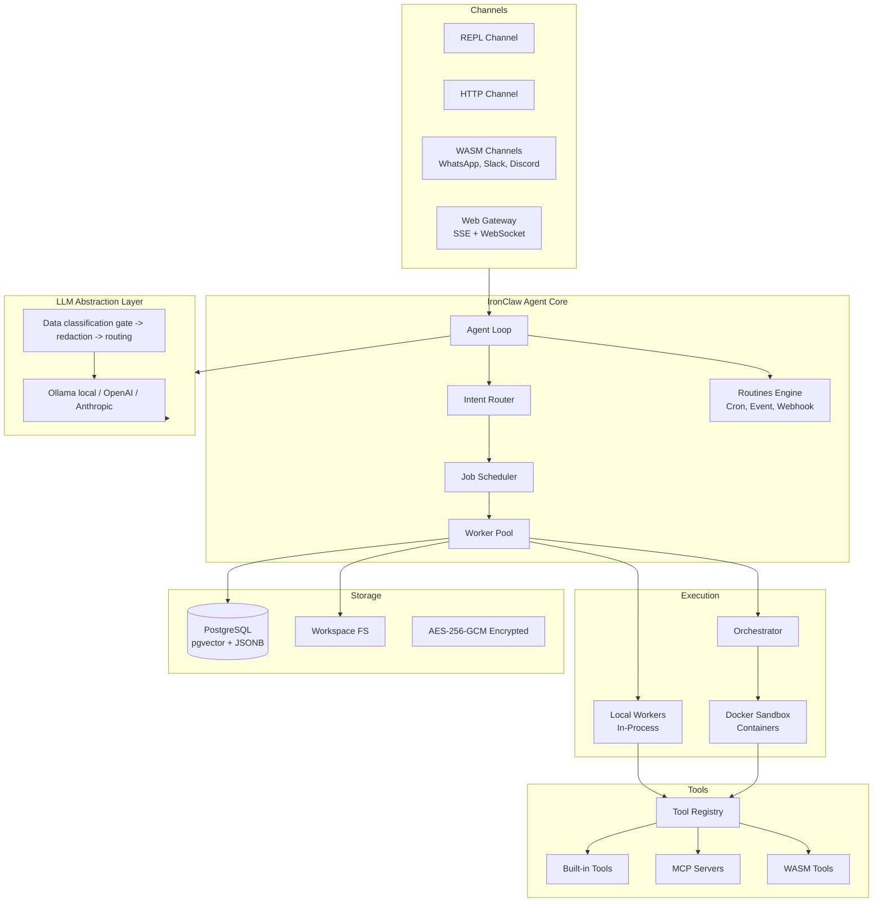
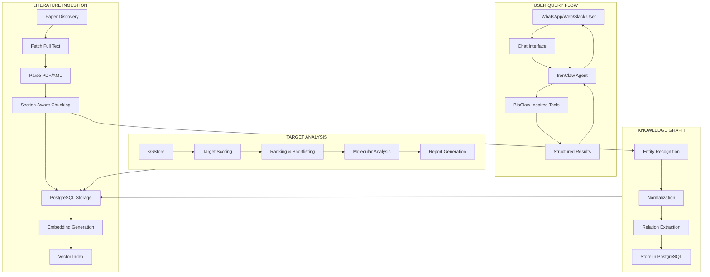

# ARCHITECTURE_NEW.md

# Ferrumyx Architecture with IronClaw & BioClaw Integration

**Autonomous Oncology Discovery System with Rust-Based Privacy Focus**  
**Built on IronClaw Framework with BioClaw Methodology**  
**Version:** 2.0.0-proposal  
**Repository:** https://github.com/Classacre/ferrumyx  
**Status:** Proposed Architectural Shift  
**Date:** 2026-04-12

---

> **Scope**: This document outlines a major architectural shift from the current Ferrumyx system to a Rust-based, privacy-focused platform using IronClaw (from NearAI) as the orchestration framework and BioClaw's tools and methodology for biomedical research. The goal is to combine Ferrumyx's oncology focus with IronClaw's security model and BioClaw's conversational bioinformatics capabilities.

## Table of Contents

1. [Introduction and Motivation](#introduction-and-motivation)
2. [Comparison of Current vs Proposed Architecture](#current-vs-proposed-architecture)
3. [High-Level Architecture Diagram](#high-level-architecture-diagram)
4. [Core Components](#core-components)
   - [Agent Loop (IronClaw)](#agent-loop-ironclaw)
   - [Tool System (BioClaw-inspired)](#tool-system-bioclaw-inspired)
   - [Storage Layer](#storage-layer)
   - [LLM Abstraction Layer](#llm-abstraction-layer)
   - [Security Boundary Definitions](#security-boundary-definitions)
5. [Data Flow](#data-flow)
6. [Storage Design](#storage-design)
7. [Implementation Roadmap](#implementation-roadmap)
8. [Advantages of the New Architecture](#advantages-of-the-new-architecture)

---

## Introduction and Motivation

### Current Ferrumyx Architecture
The existing Ferrumyx system is a Rust-native oncology discovery platform built on a custom runtime core. It features:
- Custom agent orchestration with `ferrumyx-agent`
- LanceDB for embedded vector storage
- Native Rust tools for ingestion, KG construction, ranking, and molecular analysis
- Focus on autonomous literature-driven target discovery

### Proposed Architectural Shift
The proposed architecture maintains Ferrumyx's oncology research focus while integrating:
- **IronClaw**: A production-grade Rust AI agent framework from NearAI with enterprise security, WASM sandboxing, and multi-channel support
- **BioClaw Methodology**: A conversational, skill-based approach to bioinformatics with 25+ built-in skills for common biomedical tasks

### Key Benefits
- **Enhanced Security**: IronClaw's defense-in-depth security model with WASM/Docker sandboxing
- **Privacy Focus**: Local-first architecture with encrypted PostgreSQL storage
- **Conversational Interface**: BioClaw's WhatsApp/web chat interface for natural language interaction
- **Tool Ecosystem**: BioClaw's pre-built skills for BLAST, FastQC, PyMOL, PubMed search, etc.
- **Production Ready**: IronClaw's battle-tested framework with active development and enterprise features

---

## Current vs Proposed Architecture

| Aspect | Current Ferrumyx | Proposed Architecture |
|--------|------------------|----------------------|
| **Orchestration** | Custom Ferrumyx Runtime Core | IronClaw (NearAI) |
| **Language** | Rust | Rust |
| **Storage** | LanceDB (embedded) | PostgreSQL with pgvector |
| **Security Model** | Basic | Enterprise-grade (WASM sandbox, credential protection, leak detection) |
| **Chat Interface** | Web UI + API | WhatsApp, Web, Discord, Slack, etc. |
| **Tool System** | Native Rust tools | BioClaw-inspired skills (25+ pre-built) |
| **Sandboxing** | Minimal | WASM + Docker containers |
| **LLM Providers** | Ollama, OpenAI, etc. | IronClaw's extensible provider system |
| **Persistence** | Files + LanceDB | PostgreSQL + encrypted secrets |
| **Development Status** | Active MVP | Production-ready framework |

---

## High-Level Architecture Diagram



---

## Core Components

### Agent Loop (IronClaw)

The central orchestrator that coordinates all system activity using IronClaw's battle-tested agent loop:

```rust
pub struct Agent {
    config: AgentConfig,
    deps: AgentDeps,
    channels: Arc<ChannelManager>,
    context_manager: Arc<ContextManager>,
    scheduler: Arc<Scheduler>,
    router: Router,
    routines_engine: RoutinesEngine,
    tool_registry: ToolRegistry,
    llm_router: LlmRouter,
    workspace: Workspace,
    audit_logger: AuditLogger,
}
```

**Key Features:**
- Multi-channel message handling (REPL, HTTP, WhatsApp, Slack, Discord, Web)
- Intent classification and routing
- Parallel job execution with priorities
- Scheduled and reactive background tasks
- Session and thread management

### Tool System (BioClaw-inspired)

The tool system extends IronClaw's extensible tool architecture with BioClaw's bioinformatics skills:

#### Tool Domains
| Domain | Description | Examples | Risk |
|--------|-------------|----------|------|
| **Orchestrator** | Safe for main process | `echo`, `time`, `json`, `http`, `memory_*` | Low |
| **Container** | Requires sandbox | `shell`, `read_file`, `write_file`, `apply_patch` | High |

#### BioClaw-Inspired Skills
The system includes 25+ pre-built skills for common bioinformatics tasks:

```text
BioClaw-Inspired Skills:
- Workspace Triage & Next Steps
- FastQC Quality Control
- BLAST Sequence Search
- Volcano Plot Generation
- Protein Structure Rendering (PyMOL)
- PubMed Literature Search
- Hydrogen Bond Analysis
- Binding Site Visualization
- Sequence Alignment (BWA/minimap2)
- Variant Calling
- Pharmacogenomics Analysis
- GWAS Lookup
- Polygenic Risk Scores
- UK Biobank Search
- And 15+ additional omics and visualization skills
```

Each skill follows a consistent format:
```markdown
# Skill
## Purpose
## Tools Used
## Output Format
## Example Commands
```

#### Skill Discovery and Loading
Skills are discovered from:
- `container/skills/` directory
- `.claude/skills/` directory
- Remote skill repositories (optional)

### Storage Layer

The system uses PostgreSQL with pgvector for production-grade storage:

```sql
-- Core Tables
CREATE TABLE papers (
    id UUID PRIMARY KEY DEFAULT gen_random_uuid(),
    doi TEXT UNIQUE,
    pmid TEXT,
    pmcid TEXT,
    title TEXT NOT NULL,
    abstract TEXT,
    authors JSONB,
    journal TEXT,
    pub_date DATE,
    source TEXT,
    open_access BOOLEAN,
    full_text_url TEXT,
    ingested_at TIMESTAMPTZ DEFAULT NOW()
);

CREATE TABLE paper_chunks (
    id UUID PRIMARY KEY DEFAULT gen_random_uuid(),
    paper_id UUID REFERENCES papers(id) ON DELETE CASCADE,
    section_type TEXT,
    chunk_index INTEGER,
    content TEXT NOT NULL,
    token_count INTEGER,
    embedding VECTOR(768),
    created_at TIMESTAMPTZ DEFAULT NOW()
);

CREATE TABLE entities (
    id UUID PRIMARY KEY DEFAULT gen_random_uuid(),
    paper_id UUID REFERENCES papers(id) ON DELETE CASCADE,
    entity_type TEXT NOT NULL,  -- 'GENE', 'DISEASE', 'CHEMICAL'
    entity_text TEXT NOT NULL,
    normalized_id TEXT,
    score FLOAT,
    created_at TIMESTAMPTZ DEFAULT NOW()
);

CREATE TABLE kg_facts (
    id UUID PRIMARY KEY DEFAULT gen_random_uuid(),
    paper_id UUID REFERENCES papers(id) ON DELETE CASCADE,
    subject_id UUID,
    subject_name TEXT,
    predicate TEXT,
    object_id UUID,
    object_name TEXT,
    confidence FLOAT,
    evidence TEXT,
    evidence_type TEXT,
    created_at TIMESTAMPTZ DEFAULT NOW()
);

CREATE TABLE target_scores (
    id UUID PRIMARY KEY DEFAULT gen_random_uuid(),
    gene_entity_id UUID,
    cancer_entity_id UUID,
    composite_score FLOAT,
    component_scores JSONB,
    scored_at TIMESTAMPTZ DEFAULT NOW(),
    is_current BOOLEAN DEFAULT TRUE
);

CREATE TABLE workspace_memory (
    id UUID PRIMARY KEY DEFAULT gen_random_uuid(),
    scope TEXT,  -- 'global', 'thread', 'user'
    content TEXT,
    created_at TIMESTAMPTZ DEFAULT NOW()
);
```

### LLM Abstraction Layer

IronClaw's extensible LLM system with data classification:

```rust
#[async_trait]
pub trait LlmBackend: Send + Sync {
    async fn complete(&self, request: LlmRequest) -> Result<LlmResponse, LlmError>;
    async fn embed(&self, texts: Vec<String>) -> Result<Vec<Vec<f32>>, LlmError>;
    fn model_id(&self) -> &str;
    fn supports_local(&self) -> bool;
    fn max_context_tokens(&self) -> usize;
}

pub struct LlmRouter {
    backends: HashMap<String, Arc<dyn LlmBackend>>,
    policy: RoutingPolicy,
    data_gate: DataClassificationGate,
    audit_logger: AuditLogger,
}
```

**Routing Policy:**
- `DataClass::Public` → any backend (prefer local if available)
- `DataClass::Internal` → local only OR explicit override with audit log
- `DataClass::Confidential` → local only; remote call = hard block + alert

### Security Boundary Definitions

| Boundary | Description | Enforcement |
|----------|-------------|-------------|
| **Host ↔ WASM** | WASM tools cannot access filesystem, network, or secrets | WASM capability model (10MB memory limit, CPU metering) |
| **Host ↔ Docker** | Docker containers network-isolated | Docker network policy + orchestrator |
| **Ferrumyx ↔ Remote LLM** | Data classification gate blocks sensitive data | Rust middleware in LlmRouter |
| **DB Credentials** | Never passed to tool layer | Only accessed by host process via AES-256-GCM keychain |
| **API Keys** | Injected at host boundary | Scoped tokens for WASM tools |
| **Public API Calls** | All outbound calls logged | Ingestion audit log with endpoint + response hash |

---

## Data Flow



---

## Storage Design

### Database Schema
The system uses PostgreSQL with the following extensions:
- `pgvector` for vector embeddings and similarity search
- `pg_cron` for scheduled tasks (optional)
- Standard JSONB for flexible metadata storage

### Hybrid Search
Reciprocal Rank Fusion (RRF) combining:
- Cosine similarity from vector embeddings
- BM25-style full-text ranking

### Workspace and Memory
- **Workspace**: Filesystem-based storage for intermediate files, logs, and context
- **Memory**: Markdown-based persistent memory with SQLite metadata index
- **Secrets**: AES-256-GCM encrypted with per-secret derived keys

### Encryption
- All data at rest encrypted via PostgreSQL
- Secrets encrypted with AES-256-GCM
- Optional field-level encryption for sensitive biomedical data

---

## Implementation Roadmap

### Phase 1: Foundation (4-6 weeks)
1. Set up IronClaw framework and dependencies
2. Migrate PostgreSQL schema from LanceDB
3. Implement basic ingestion pipeline
4. Set up LLM abstraction layer with data classification
5. Create initial BioClaw-inspired skills for core bioinformatics tasks

### Phase 2: Core Features (6-8 weeks)
1. Implement full paper ingestion from PubMed, Europe PMC, bioRxiv
2. Build entity recognition and knowledge graph construction
3. Develop target scoring and ranking engine
4. Integrate molecular analysis tools (PyMOL, docking)
5. Create web and chat interfaces

### Phase 3: Advanced Capabilities (4-6 weeks)
1. Implement self-improvement feedback loops
2. Add federated knowledge base distribution
3. Deploy Docker sandbox orchestration
4. Create advanced security features (leak detection, prompt injection defense)
5. Optimize performance and add monitoring

### Phase 4: Testing and Deployment (2-4 weeks)
1. End-to-end testing with sample oncology queries
2. Performance benchmarking and optimization
3. Security audit and penetration testing
4. Documentation and user training
5. Production deployment

---

## Advantages of the New Architecture

### Security and Privacy
- **Enterprise-Grade Security**: WASM sandbox, Docker isolation, credential protection
- **Local-First**: All data stored locally with encrypted secrets
- **Zero Telemetry**: No data collection or sharing by default
- **Audit Trail**: Complete logging of all tool executions and LLM calls

### Production Readiness
- **Battle-Tested Framework**: IronClaw is used in production environments
- **Active Development**: Rapid iteration with enterprise features
- **Extensible**: MCP protocol, WASM tools, custom skill system
- **Scalable**: PostgreSQL with pgvector handles millions of records

### User Experience
- **Conversational Interface**: Natural language interaction via WhatsApp, web, Slack
- **Skill-Based Workflows**: Pre-built skills for common bioinformatics tasks
- **Persistent Memory**: Context-aware conversations with memory across sessions
- **Real-Time Dashboard**: Observability into agent execution and results

### Development Efficiency
- **Reuse Existing Tools**: BioClaw's 25+ skills provide immediate functionality
- **Rust Ecosystem**: Safe, performant, single-binary deployment
- **Community Support**: Active OpenClaw/IronClaw ecosystem with shared knowledge
- **Modularity**: Clean separation of concerns with extensible tool system

---

## Conclusion

This architectural shift proposes moving Ferrumyx from a custom Rust implementation to the IronClaw framework while incorporating BioClaw's bioinformatics methodology. The result is a more secure, production-ready, and user-friendly system that maintains Ferrumyx's oncology research focus while adding powerful new capabilities for conversational biomedical research.

The integration leverages the strengths of both projects:
- **IronClaw's** security-first design and production features
- **BioClaw's** skill-based approach and pre-built bioinformatics tools
- **Ferrumyx's** oncology domain expertise and target discovery focus

This combination creates a next-generation autonomous oncology discovery platform that is both powerful and trustworthy, with privacy built into its foundation.

---

**Next Steps:**
1. Review this architecture document with the team
2. Set up a proof-of-concept with IronClaw and sample BioClaw skills
3. Evaluate migration complexity and resource requirements
4. Create detailed implementation plan with milestones
5. Begin Phase 1 development after approval