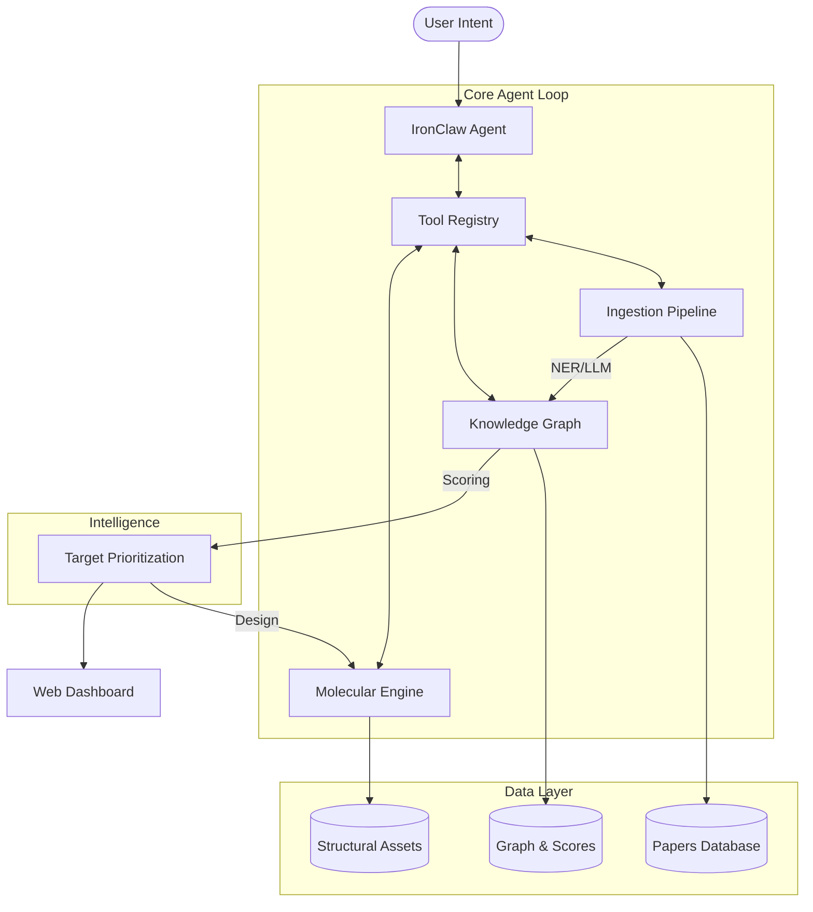

# Ferrumyx

<div align="center">
  
</div>

<div align="center">
  <a href="https://colab.research.google.com/github/Classacre/ferrumyx/blob/main/ferrumyx_colab.ipynb">
    
  </a>
</div>

**Open-Source Autonomous Oncology Drug Discovery Engine**

Ferrumyx is an autonomous R&D engine built natively in Rust on the [IronClaw](https://github.com/nearai/ironclaw) autonomous agent framework. Designed as a fully self-improving scientific system, Ferrumyx orchestrates end-to-end therapeutic target discovery and molecular design without human intervention. 

By leveraging IronClaw's robust event loop, reasoning capabilities, and Tool Registry, Ferrumyx operates as a persistent agent. It autonomously queries the latest biomedical literature, constructs and updates a dense Knowledge Graph within a local embedded LanceDB, and iteratively refines its multi-parametric scoring heuristics based on continuous evaluation of generated targets. This closed-loop learning architecture ensures that the system's predictive accuracy scales with its ingestion volume.

For a detailed technical breakdown of the engine's layers, reasoning loop, and state management, please refer directly to the [Architecture Document (ARCHITECTURE.md)](ARCHITECTURE.md).

## Current Status (Phase 3: Verification & Autonomy)

| Component | Status | Notes |
|-----------|--------|-------|
| **Ingestion** | ✅ Working | Unified pipeline (PubMed, PMC, BioRxiv) |
| **NER & KG** | ✅ Working | Consolidated into `ferrumyx-kg` (Aho-Corasick) |
| **Embedding** | ✅ Working | Pure Rust BiomedBERT (768-dim, Candle) |
| **Ranker** | ✅ Working | Multi-factor scoring + DepMap integration |
| **Molecular** | ✅ Working | Structural analysis & Ligand generation |
| **Agent Loop** | ✅ Working | IronClaw-driven autonomous orchestration |
| **Web GUI** | ✅ Working | Interactive Dashboard & KG Visualization |

**100% Rust.** No Python dependencies. All components are Rust-native. No external database required (LanceDB/libSQL embedded).

## Architecture

The system follows a reactive Agentic Architecture, where the IronClaw agent serves as the central brain, orchestrating specialized tools for literature ingestion, Knowledge Graph (KG) management, and molecular modeling.



## Computational Methodology

Ferrumyx leverages a defense-in-depth architecture to mitigate performance bottlenecks in large-scale scientific computation. By operating independently of external data services, we ensure computational reproducibility and data security.

### Core Algorithmic Components

1. **Information Extraction Engine**
   Optimized biomedical NER via Aho-Corasick dictionary matching and LLM-assisted relationship extraction. Processes Genes, Proteins, Chemicals, and Mutations with high precision.

2. **Graph-Theoretic Knowledge Representation**
   Semantic triplets are stored in an embedded LanceDB vector database. SimHash-based deduplication and cross-reference conflict resolution ensure KG integrity.

3. **Composite Target Prioritization Matrix**
   Implements a multi-parametric heuristic function `S(g,c)` merging:
   - Mutation frequencies & Structural variants
   - CRISPR dependency models (DepMap)
   - Survival correlates & Expression data
   - Proteomic pocket detectability

4. **IronClaw Autonomous Orchestration**
   The system is non-human gated. Results are fed back to the IronClaw agent, which can autonomously modify parameters, create new search tools, or refine molecular optimization strategies until a viable "solution" is found.

## Project Structure (Crates)

| Crate | Description | Status |
|-------|-------------|--------|
| `ferrumyx-agent` | IronClaw-powered Primary Event Loop & Tool Registry | ✅ Working |
| `ironclaw` | Core autonomous agent framework & reasoning engine | ✅ Working |
| `ferrumyx-ingestion` | Unified literature pipeline (PubMed, PDF, Embedding) | ✅ Working |
| `ferrumyx-kg` | Knowledge Graph, NER, & Target Scoring logic | ✅ Working |
| `ferrumyx-ranker` | Multi-factor prioritization (DepMap integration) | ✅ Working |
| `ferrumyx-molecules` | Structural analysis, ADMET, & Ligand generation | ✅ Working |
| `ferrumyx-db` | LanceDB & libSQL embedded database layer | ✅ Working |
| `ferrumyx-common` | Shared types, schemas, and utility functions | ✅ Working |
| `ferrumyx-web` | Real-time Dashboard & Interactive Visualizations | ✅ Working |

## Quick Start

```powershell
# Windows: Set Protobuf path (required for LanceDB)
$env:PROTOC = "C:\protoc\bin\protoc.exe"

# Easy start (Installs Rust, selects models, and runs)
.\start.ps1

# Manual run
cargo run --release --bin ferrumyx
```

## License

Apache-2.0 OR MIT
